# 计算机网络

这是计算机网络的大纲（大概）

[TOC]

------

# 第一章：概述

本章重要的内容有：

- 互联网边缘部分和核心部分的作用；分组交换的概念。

- 网络性能的指标。

- 计算机网络分层次的体系结构；协议和服务的概念

  

## 1.1 计算机网络在信息时代中的作用

## 1.2 互联网概述

### 1.2.1 网络的网络

**计算机网络**由若干**节点**和连接这些节点的**链路**组成。

### 1.2.2 互联网基础结构发展的三个阶段

### 1.2.3 互联网的标准化工作

## 1.3 互联网的组成

### 1.3.1 互联网的边缘部分

 1. 客户-服务器方式

    客户是服务请求方，服务器是服务提供方。

    

 2. 对等连接方式

### 1.3.2 互联网的核心部分

  1. 电路交换的主要特点

必须经过“**建立连接-通话-释放连接**”三个步骤的交换方式称为**电路交换**。

2. 分组交换的主要特点

分组交换采用**存储转发**技术。每一个分组在互联网中独立地选择传输路径，并被正确地交付到分组传输的终点。

分组交换有**高效、灵活、迅速、可靠**的优点，但是在路由器存储转发的过程中需要排队，因此会造成一定的**时延**。

若要传输大量的数据，且传送时间远大于连接建立时间，则适合使用电路交换；否则应当使用报文交换或者分组交换。

## 1.4 计算机网络在我国的发展

## 1.5 计算机网络的类别

### 1.5.1 计算机网络的定义

计算机网络主要是由一些通用的、可编程的硬件互连而成的，而这些硬件并非专门用来实现某一特定目的。这些可编程的硬件能够用来传送多种不同类型的数据，并能支持广泛的和日益增长的应用。（一定有CPU）

### 1.5.2 几种不同类别的计算机网络

  1. 按照网络的作用范围进行分类

广域网WAN、城域网MAN、局域网LAN、个人局域网PAN

2. 按照网络的使用者进行分类

公用网、专用网

3. 用来把用户接入互联网的网络

接入网AN

## 1.6 计算机网络的性能

### 1.6.1 计算机网络的性能指标

  1. 速率（$10^x$表示)

bit/kbit/Mbit/Gbit/Tbit/Pbit/Ebit/Zbit/Ybit

2. 带宽

在计算机网络中，网络带宽表示单位时间内某信道所能通过的**最高数据率**，单位是bit/s。

3. 吞吐量

吞吐量表示在单位时间内通过某个网络的**实际数据量**。

4. 时延

总时延的计算公式
$$
总时延 = 发送时延 + 传播时延 + 处理时延 + 排队时延
$$
发送时延的计算公式：
$$
发送时延 = \frac{数据帧长度(bit/s)}{发送速率(bit/s)}
$$
传播时延的计算公式：
$$
传播时延 = \frac{信道长度(m)}{电磁波在信道上的传输速率(m/s)}
$$
通常有铜线 = $2.3*10^5(km/s)$，光纤 = $2.0*10^5(km/s)$。

在某些情况下，低速率、小时延的网络可能优于一个高速率、大时延的网络。

5. 时延带宽积

$$
时延带宽积 = 传播时延 * 带宽
$$

6. 往返时间RTT

在计算机网络中，<u>往返时间</u>也是一个重要的性能指标。

这是因为在许多情况下，互联网上的信息不仅仅是单方面的，而是双向交互的。

7. 利用率

网络当前时延计算公式如下：
$$
网络当前时延 = \frac{网络空闲时的时延}{1-当前网络利用率}
$$
写作如下的公式：
$$
D = \frac{D_{0}}{1-U}
$$

可以看到，随着利用率的增大，时延急剧增大。

### 1.6.2 计算机网络的非性能特征

1. 费用

2. 质量

3. 标准化

4. 可靠性

5. 可扩展性和可升级性

6.易于管理和维护

## 1.7 计算机网络体系结构

在计算机网络的基本概念中，**分层次的体系结构**是最基本的。

### 1.7.1 计算机网络体系结构的形成

### 1.7.2 协议与划分层次

**为了进行网络中的数据交换而建立的规则、标准或者约定称为网络协议，简称为协议。**

协议应当由以下三要素组成：**语法、语义与同步**。

### 1.7.3 具有五层协议的体系结构

应用层、运输层、网络层、数据链路层、物理层。

### 1.7.4 实体、协议、服务与服务访问点

实体：任何可能发送或接受信息的硬件或软件进程。

协议：控制两个或多个对等实体进行通信的规则的集合。

**在协议的控制下，两个对等实体间的通信使得本层能向上一层提供服务**。要实现本层协议，还需要使用下面一层所提供的**服务**。

协议的实现确保了能够向上一层提供服务，使用本层服务的实体只能看到服务而看不到下面的协议，也即下面的协议对上面的实体是透明的。

# 第二章：物理层

本章的重要内容：

- 物理层的任务。

- 几种常用的信道复用技术。

- 几种常用的宽带接入技术；FTTx。

  

## 2.1 物理层的基本概念

物理层考虑的是怎样才能在连接各种计算机的传输媒体上传输数据比特流，而不是具体的传输媒体。

## 2.2 数据通信的基础知识

### 2.2.1 数据通信系统的模型

一个数据通信系统可以分为三大部分：**源系统、传输系统、目的系统**。

源系统一般包含：**源点、发送器**；目的系统一般包含：**接收器、终点**。

通信的目的是传送消息；数据是运送消息的实体；信号是数据的电气/电磁表现，可以分为数字信号与模拟信号。

### 2.2.2 有关信道的几个基本概念

信道不等同于电路，信道一般用来表示向某一个方向传输信息的媒体。从通信的双方信息交互的方式来看，有三种方式：

 1. 单向通信

    又称为**单工通信**，比如无线电广播。

 2. 双向交替通信

    又称为**半双工通信**。一方发送另一方接受，一段时间后再反过来。

 3. 双向同时通信

    又称为**全双工通信**，双方可以同时发送和接收信息。

来自信源的信号常称为**基带信号**，比如计算机输出的各种文字、图像的数据信号就是基带信号。它往往包含了较多的低频分量，甚至有直流分量。而许多信道不能传输这种低频分量或直流分量，因此需要**调制**。

调制可以分为两类：

- 基带调制（编码）

  仅仅对基带信号的波形进行变换，使它能够与信道特性相适应。变换后的信号仍然是基带信号。因为它只是把数字信号转换为另一种数字信号，因此也叫做编码。

- 带通调制

  利用**载波**进行调制，把基带信号的频率范围移动到更高的频段，并转换为模拟信号，便于在模拟信道中传输。

常用编码方式：不归零制、归零制、曼彻斯特编码、差分曼彻斯特编码。

曼彻斯特编码产生的信号频率比不归零制要高。

基本的带通调制方法：调幅、调频、调相。（模拟信号：$ Asin(ωt+φ)$）

采用**正交振幅调制QAM**可以达到更高的信息传输速率。

### 2.2.3 信道的极限容量

从概念上讲，限制码元在信道上的传输速率的因素有：

1. 信道能够通过的频率范围

**奈氏准则**：在**带宽为W（Hz）**的低通通道中，若不考虑噪声影响，则**码元传输的最高速率是2W（码元/s）**。传输速率超过此上限就会出现严重的码间串扰问题，使得接收端对于码元的判别变得不可能。

奈氏准则告诉我们：可以提高码元携带的比特量。

2. 信噪比

信噪比是信号的平均功率和噪声的平均功率之比，记为S/N。但是常用分贝（db）作为度量单位，即：
$$
信噪比(dB)=10log_{10}(\frac{S}{N})(dB)
$$
例如当S/N=10时，信噪比为10dB。

**香农公式**：信道的极限信息传输速率：
$$
C=Wlog_{2}(1+\frac{S}{N})(bit/s)
$$
其中W为信道带宽(Hz)，S为信道内传信号的平均功率，N为信道内的高斯噪声功率。

香农公式表明，**信噪比越大，信息的极限传输速率就越高**。也就是说，只要信息传输速率低于信道的极限信息传输速率，就有办法实现无差错的传输。

香农公式告诉我们：无论采用什么编码都不能突破速率极限。

而当带宽确定、信噪比无法提高的时候，就要使得**每一个码元携带更多比特的信息量**来提高信息传输速率。比如对于101001010，直接传送的码元信息量为1bit，但是将每3bit编组，并用利用调制，比如相位调制，则可以用三个相位来表示，则此时同样时间传输的信息量是原来的三倍。

## 2.3 物理层下面的传输媒体

传输媒体（传输介质、传输媒介）可以分为两类：导引型传输媒体、非导引型传输媒体。

### 2.3.1 导引型传输媒体

 1. 双绞线

    双绞线是最老的、最常用的传输媒体。无屏蔽双绞线 < 屏蔽双绞线。

 2. 同轴电缆

 3. 光缆

    光纤通信是利用光导纤维传递光脉冲来通信的。光线在纤芯中传输的方式是不断地全反射。

### 2.3.2 非导引型传输媒体

无线电微波通信：沿直线传播。当基站发出的信号被阻挡，于是产生多条路径到达手机的时候，多条路径的信号叠加会差生较大的失真，称为**多径效应**，需要解决。

当利用无线信道传输数字信号的时候，需要使误码率不大于容许的范围。

- 对于给定的调制方式和数据率，信噪比越大，误码率越低。
- 对于同样的信噪比，具有更高数据率的调制技术的误码率也更高。
- 如果地理位置在不断改变，就会引起信噪比和误码率的改变。

卫星通信是一种利用人造同步卫星作为中继器的微波接力通信，最大的特点是通信距离远、通信费用和通信距离无关，但是也有较大的时延。

## 2.4 信道复用技术

复用是通信技术中的基本概念。

复用是利用复用器和分用器实现一个信道传输多路信号的操作。

### 2.4.1 频分复用、时分复用、统计时分复用

频分复用FDM：频分复用是利用调制的方法，将各路信号移动到合适的频率位置。各路信号在同样的时间占用不同的频率带宽资源。

时分复用TDM：将时间划分为一段段等长的时分复用帧，每个型号所占用的时隙周期性的出现。所有用户在不同时间占用同样的频段宽度。

让多个用户轮流使用N个频段称为频分多址接入FDMA；让多个用户轮流使用时隙称为时分多址接入TDMA。

统计时分复用STDM是一种改进的时分复用。统计时分复用使用STDM帧来传送数据，但是帧中的时隙数小于用户数，而当用户有了数据就发送到集中器的输入缓存中，然后集中器把缓存缓存中的数据输入到帧中，帧满了就发送。

### 2.4.2 波分复用

波分复用 WDM，就是**光的频分复用**，使用一根光纤来传输多个频率接近的光载波信号。

### 2.4.3 码分复用

码分复用 CDM 是另一种共享信道的方法。当码分复用信道为多个不同地址的用户所共享的时候就称为码分多址 CDMA 。

码分复用的每一个人可以在同样的时间使用同样的频带进行通信，但由于码型不同，因此用户之间不会产生干扰。

在 CDMA 中，每一个比特时间再划分为 m 个短的间隔，称为**码片**，使用 CDMA 的每一个站都被指派唯一的 $m$ bit 码片序列。对于发送，有以下规则：

- 如果要发送比特 1，则发送 $m$ bit码片序列。
- 如果要发送比特 0，则发送该码片序列的反码。

例如，指派给 S 站的 8 bit 码片序列为 0001 1011，则如果要发送比特 1 则发送序列 0001 1011，而发送比特 0 时则发送 1110 0100 。为了方便，在这里我们将其中的 0 记为 -1 ，1 记为 +1 ，也即 S 站的码片序列为（-1 -1 -1 +1 +1 -1 +1 +1）。

在这里可以看出，如果要发送的信息数据率为 $b$ bit/s, 而S站如果有 $m$ bit 码元序列，则实际上发送的数据率要到 $mb$ bit/s。因此需要用到**扩频**技术。在这里使用的是**直接序列扩频 DSSS**，还有一种方法是**调频扩频 FHSS**。

CDMA 系统有一个重要特点：每个站的码片序列不仅必须各不相同，还必须**正交**。在这里假设两个站的码片序列为 $\vec{S}$, $\vec{T}$，则应当有：
$$
\vec{\mathbf{S}} \cdot \vec{\mathbf{T}} =0
$$
不仅如此，我们还可以看出，任何一个码片序列向量和自己的规格化内积都是0：
$$
\mathbf{\vec{S}} \cdot \mathbf{\vec{S}} = 1
$$
同理，我们也可以得到如果一个码片向量和反码的向量的规格化内积为-1。

那么现在，假设有一个X站要接收S站发送的信号，则X站必须知道S站的码片序列，然后利用X站得到的码片向量$\vec{S}$进行解码。假设还有一个T站也在发送序列$\vec{T_{x}}$，则根据叠加原理，可以这么计算：
$$
\begin{array}{l}  
接收到的信号 \\
= \vec{S} \cdot (\vec{S_{x}} + \vec{T_{x}}) \\
= \vec{S} \cdot \vec{S_{x}} + \vec{S} \cdot \vec{T_{x}} \\
= \vec{S} \cdot \vec{S_{x}} (发送的数据比特，因为运算的结果一定是+1/-1) + 0(一定为0，因为正交) \\
= 发送的数据
\end{array}
$$

## 2.5 数字传输系统

早期的数字传输系统速率标准不统一、也不是同步传输。

## 2.6 宽带接入技术

从宽带的接入媒体来看，可以划分为两大类：有线宽带接入、无线宽带接入。

### 2.6.1 非对称用户数字线 ADSL 

非对称用户数字线 ADSL 技术是**用数字技术对现有模拟电话的用户线进行改造**。它把 0~4KHz 低端频谱留给传统电话使用，而把较高频谱给用户上网使用。因为下行带宽远大于上行带宽，因此是“非对称”。

ADSL 两端都需要安装 ADSL 调制解调器。我国采用的是离散多音调 DMT 调制技术。这种做法相当于在一对用户线上使用许多小的调制解调器并行的传输数据。

基于 ADSL 的接入网由**数字用户线接入复用器 DSLAM 、用户线、用户家中设施**三部分组成。ADSL 可以利用现有的电话网中的用户线，而不需要重新布线。

### 2.6.2 光纤同轴混合网 HFC网

光纤同轴混合网是在目前覆盖面很广的有线电视网的基础上开发的一种居民宽带接入网。目前的 HFC 网具有双向传输功能，而且扩展了传输频带。

要使现有的模拟电视能接收数字信号，需要把**机顶盒**连接在同轴电缆和电视机之间。为了使用户能够接入互联网，还需要增加**电缆调制解调器**。

### 2.6.3 FTTx 技术

光纤到户 FTTH 是最好的选择，这可以使用户获得最高的上网速率。FTTx 中的 x 表示不同的光纤接入地点。

为了有效地利用光纤资源，在光纤干线和广大用户之间，还要铺设一段中间的转换装置**光配线网**，使得数十个家庭用户能共享一个光纤干线。光配线网使用波分复用，上行和下行使用不同的带宽。

# 第三章：数据链路层

数据链路层使用的信道主要分为：点对点通信、广播信道。

在本章中，主要研究的是在同一个局域网中，分组怎样从一个主机传输到另一个主机，但不经过路由器的转发。从整个互联网来看，局域网仍然属于数据链路层的范围。

本章将首先介绍点对点通信，以及在这种信道上最常用的协议PPP。然后再介绍共享信道的局域网，以及有关的协议。

本章的重要内容有：

- 数据链路层的点对点信道和广播信道的特点，以及PPP协议、CSMA/CD协议的特点。
- 数据链路层的三个问题：封装成帧、透明传输以及差错检测。
- 以太网MAC层的硬件地址。
- 适配器、转发器、集线器、网桥、以太网交换机的作用以及使用场合。

## 3.1 数据链路层的几个问题

### 3.1.1 数据链路和帧

数据链路指的是传输数据的线路、协议、实现协议的硬件、软件等的集合体。现在最常用的方法就是网络适配器来实现这些协议，一般的网络适配器都会包括数据链路层和物理层两层的功能。

帧是点对点通信的数据链路层的协议数据单元。数据链路层把网络层放下来的数据封装成帧，并把接受大的帧中的数据取出交给网络层。

### 3.1.2 三个基本问题

数据链路层的协议有很多，但是三个基本问题是共同的：封装成帧，透明传输和差错检测。

1. 封装成帧

封装成帧是指在一段数据的前后分别添加首部和尾部，这样就构成了一个帧。首部和尾部的一个重要作用是帧定界，除此之外也包含了必要的控制信息。

每一种链路层协议都规定了能传送帧的数据部分长度上限，也即最大传送单元 MTU 。

对于一个帧来说，用 SOH 标识头部、EOT 标识尾部，其对应的ASCII码为01、04。

2. 透明传输

透明是指，某一个实际存在的事物看起来却好像不存在一样。

在传输中，如果出现了某一个字节正好与 SOH 或者 EOT 对应的二进制代码一样的情况，那么数据链路层就会错误的找到帧的边界。为了解决这个问题，就必须使得数据中可能出现的 SOH 或者 EOT 不被解释为控制字符。

一般的方法是，在数据中的 SOH 或者 EOT 前面插入一个转义字符  ESC （1B），而接收时则会删除这个转义字符。这种方法也被称为**字节填充**或是**字符填充**。

如果转义字符也出现在数据中，那么就应当在转义字符前也添加一个转义字符。

3. **差错检测**（重要）

在传输过程中，比特可能会产生差错：1变0，0变1都是有可能的。这种差错叫做**比特差错**。为了解决 差错问题，目前在数据链路层最广泛使用的检错技术叫做：**循环冗余检验 CRC**。

CRC 在发送端把数据划分成组，假设划分完成之后的数据 M 有 k 位，则在 M 后面添加 n 位**冗余码**，然后构成一个 k+n 位的帧发送出去，以此完成差错检验。

这 n 位冗余码可以这样得出：在 M 后面添加 n 个0，然后用得到的 k+n 位数除以事先规定好的 n+1 位除数 P，得到商 Q 和 余数 R（n 位，比 P 少一位）。这个余数 R 就是冗余码，我们称它为**帧检验序列FCS**。

而在接收端，把接收到的每一个帧都除以相同的除数 P ，然后检查得到的余数 R ，如果传输无差错，那么 R 肯定为 0。

在这里需要注意的是，CRC 和 FCS 并无关系。CRC 是一种检错方法，而 FCS 是冗余码。在检错方法中，可以使用 CRC，也可以不使用。

但是利用 CRC 的话，也只能做到检测比特差错，对于传输差错则并不能检验，因此这还不是可靠传输。在过去认为，必须让数据链路层向上提供可靠传输，也即在 CRC 的基础上增加帧编号、确认和重传机制，但是现在采用了其他的方法：

1、对于通信质量良好的链路，不要求数据链路层向上提供可靠传输的服务。如果出现了差错，则由上层协议改正差错。

2、对于通信质量不好的线路，数据链路层协议使用确认和重传机制，由数据链路层向上提供可靠传输的服务。

## 3.2 点对点协议 PPP

对于点对点的链路，PPP 是目前使用的最广泛的数据链路层协议。

### 3.2.1 PPP 协议的特点

1. PPP 协议应满足的要求

   简单\封装成帧\透明性\多种网络层协议\多种类型链路\差错检测\检测连接状态\最大传送单元\网络层地址协商\数据压缩协商

   

2. PPP协议的组成

   1、一个将IP地址封装到串行链路的方法。

   2、一个用来建立、配置和测试数据链路连接的链路控制协议。

   3、一套网络控制协议。

### 3.2.2 PPP 协议的帧格式

首部有四个字段，尾部有两个字段。首部第一个字段和尾部第二个字段都是标志字符 F（7E)，而首部中的地址字段规定为 A ，控制字段规定为 C 。

首部的第四个字段是 2 字节的协议字段，若为 0x0021 时，PPP 帧信息字段为 IP 数据报；为 0xC021 时，为 PPP 链路控制协议 LCP 的数据；为 0x8021时，标识这是网络层的控制数据。

尾部第一个字段是使用 CRC 的帧检验序列 FCS。

- 当 PPP 使用异步传输（逐个字符的传输）的时候，他把转义符定义为 0x7D，并使用字节填充。
- 而当他在同步传输（一连串比特连续发送）的时候，使用零比特填充的方法实现透明传输：每当发现出现 5 个连续的 1 时，就填入一个 0，防止出现 6 个 1。

### 3.2.3 PPP 协议的工作状态

PPP 链路的起始和终止状态永远是链路静止状态，这时在用户个人电脑和 ISP 的路由器之间并不存在物理层的连接。

## 3.3 使用广播信道的数据链路层

广播信道可以进行一对多的通信，局域网使用的就是广播信道。

### 3.3.1 局域网的数据链路层

局域网的最主要的特点是：网络为一个单位所拥有，且地理范围和站点数目均有限。

局域网可以按照网络拓扑进行分类：

共享信道要着重考虑的一个问题是，如何使众多用户能海购合理方便地享受通信媒体资源，这在技术上有两种方法：

- 静态划分信道，如频分复用、时分复用、波分复用、码分复用等。用户只要分配到了信道就不会发生冲突，但是代价较高。
- 动态媒体接入控制，又称多点接入，可以分为随机接入和受控接入。随机接入地特点是用户可以随机的发送信息，但是必须要有解决碰撞的协议。

在这里，我们着重讨论属于随机接入的以太网。

1. 以太网的两个标准

   目前使用最多的局域网是 DIX Ethernet V2 ，简称以太网，而不是IEEE 802委员会制定的局域网。

2. 适配器的作用

   计算机和外界局域网是通过**适配器**。

   适配器和局域网之间的通信是通过电缆以串行方式进行的，而适配器和计算机之间的通信是通过总线以并行方式进行的，因此适配器需要能串行并行转换。因为网络上的数据率和计算机总线的并不相同，因此要有缓存芯片。

   此外，还要能把管理适配器的驱动程序安装在计算机的操作系统中，以及能够实现以太网协议。

   适配器在接收和发送数据的时候，不适用计算机的CPU。

### 3.3.2 CSMA/CD 协议

最早的以太网是将许多计算机连接在一根总线上。当一台计算机发送数据时，总线上的所有计算机都能检测到这个数据，这种就是广播通信。

为了简便的通信，以太网采取了两种措施：

1. 采用**无连接**的工作方式，不必先建立连接就可以直接发送数据。因此，以太网提供的是**不可靠的交付**。我们知道，总线上在同一时间只能允许一台计算机发送数据，否则就会产生干扰。因此以太网使用 **CSMA/CD（载波监听多点接入/碰撞检测）协议**来减少冲突。

2. 以太网发送的数据都使用**曼彻斯特编码**的信号。

下面介绍 CSMA/CD 协议的要点：

“多点接入”就是说明这是总线型网络，协议的实质是“载波监听”和“碰撞检测”。

“载波监听”是指检测总线上是否有其他计算机在发送。不管是在发送前，还是发送中，每个站都必须不停的检测信道。如果检测到已经有其他站在发送，则自己暂时不发送。

“碰撞检测”也就是“边发送边监听”，即适配器边发送数据边检测信道上的信号电压，当电压超过一定的阈值时，就认为有至少两个站在发送数据，表明产生碰撞。一旦发现总线出现碰撞，就要立即停止发送。

但是为什么在发送前监听到信道已经“空闲”，还是可能会出现碰撞？这是因为电磁波的传输速率是有限的，比如在 1km 的电缆中传播时延约为 5μs 。因此，还是有可能产生碰撞的。

在局域网的分析中，把单程的端到端传输时延记为 t ，则最迟需要 2t 的时间才能知道有无发生碰撞。

显然，在使用 CSMA/CD 协议的时候，一个站不可能同时进行发送和接收，因此使用 CSMA/CD 的以太网只能进行**半双工通信（双向交替通信）**。由此可见，每一个站在在自己发送数据之后的一小段时间内，存在着遭遇碰撞的可能性，而这一小段时间是不确定的。

在以太网中，我们称 **2t** 为**争用期**。这是一个重要的参数，又称为**碰撞窗口**。具体来说，争用期是 **51.2μs** 。对于一个 10 Mbits/s 的网络来说，争用期可以发送 512 bit，或者说是 64 字节，因此称其争用期为 512bit。因此，以太网还规定帧的最小长度是 64 字节，**小于 64 字节的帧都是由于冲突而异常终止的无效帧**。

当发送数据的站一旦发现产生碰撞的时候，要继续发送一个 32 比特或者 48  比特的**人为干扰信号**，让所有用户知道发生了碰撞。这被称为**强化碰撞**。

以太网还规定帧间最小间隔为 9.6μs 相当于 96 比特时间。这样是为了让站做好接收下一帧的准备。

根据以上所讨论的，可以把 CSMA/CD 协议的要点归纳如下:

(1)准备发送：适配器从网络层获得一个分组，加上以太网的首部和尾部(见后面的3.4.3 节)，组成以太网，放入适配器的缓存中。但在发送之前，必须先检测信道。

(2)检测信道：若检测到信道忙，则应不停地检测，一直等待信道转为空闲。若检测到信道空闲，并在 96 比特时间内信道保持空闲(保证了间最小间隔)，就发送这个帧。

(3)在发送过程中仍不停地检测信道，即网络适配器要边发送边监听。这里只有两种可能性:

1. 发送成功：在争用期内一直未检测到碰撞。这个帧肯定能够发送成功。发送完毕后，其他什么也不做。然后回到(1)。

2. 发送失败：在争用期内检测到碰撞。这时立即停止发送数据，并按规定发送人为干扰信号。适配器接着就执行指数退避算法，等待 r 倍 512 比特时间后，返回到步(2)，继续检测信道。但若重传达 16 次仍不能成功，则停止重传而向上报错。

以太网每发送完一帧，一定要把已发送的帧暂时保留一下。如果在争用期内检测出发生了碰撞，那么还要在推迟一段时间后再把这个暂时保留的帧重传一次。

### 3.3.3 使用集线器的星型拓扑

以太网发展到后来采用来星型拓扑的结构，在星形的中心增加了集线器。

集线器的特点有：

1. 从表面上看是星形网，但是实际上整个系统在逻辑上还是总线网，使用的还是 CSMA/CD 协议。在同一时刻至多允许一个站发送数据。

2. 一个集线器有多个端口，像是一个多端口的转发器。

3. **集线器工作在物理层**，每个接口也只是简单的转发比特，**不进行碰撞检测**。

   

### 3.3.4 以太网的信道利用率

因为碰撞的存在，以太网的信道利用率实际上无法达到100%。

从图中可以看出，发送一个帧需要占用信道的时间是 $T_0 + \tau $，比发送这个帧的时间要多一个单程端到端时延。从图中可以看出，如果要提高信道利用率，就必须降低 $\alpha = \frac{\tau}{T_0}$ 的值。也就是说，$\tau$ 的值药效，而 $T_0$ 的值要大，也就是说数据率一定时，以太网的连线受到长度限制，否则 $\tau$ 的数值会太大；同时以太网的帧长不能太短，否则 $T_0$ 会小。

### 3.3.5 以太网的 MAC 层

- MAC层的硬件地址

在局域网中，**硬件地址**又称为**物理地址**或者 **MAC地址** 。为了让名字与系统的所在地无关，IEEE 802制定了一种 48 位的全球地址，这就是固化在适配器 ROM 中的地址。IEEE 的注册管理机构 RA 负责分配地址字段的六个字节中的前三个字节。凡事要生产局域网适配器的厂家都必须向 IEEE 购买这三个字节组成的号。

当路由器通过适配器连接到局域网的时候，适配器的硬件地址就用来标志路由器的某个接口。我们知道适配器有**过滤功能**：如果是接收到发往本站的帧就留下，否则丢弃。在这里，发往本站的帧包括三种：单播帧、广播帧、多播帧。

除此之外，以太网适配器还可以设置成一种特殊的模式：**混杂方式**。这种方式会把以太网上的帧都记录下来。

- MAC帧的格式

这里介绍的是使用最多的以太网 V2 的 MAC 帧格式。

以太网 V2 的 MAC 较为简单，由五个字段组成：

前两个字段分别为 6 字节长的目的地址和源地址字段。

第三个字段是 2 字节的类型字段，用来标志上一层使用的是什么协议，以便把收到的 MAC 的数据上交给上一层的这个协议。例如，当类型字段的值是 0x0800时，就表示上层使用的是 IP 数据报。
​第四个字段是数据字段，其长度在 46 到 1500 字节之间 （46 字节是这样得出的：最小长度 64 字节，减去 18 字节的首部和尾部就得出数据字段的最小长度）。

最后一个字段是 4 字节的帧检验序列 FCS（使用 CRC 检验）。FCS 的检验范围是整个 MAC 帧，从目的地址到 FCS 的五个字段，但不包括物理层插入的。

从图中也能看出，在传输媒体上实际传输的要比 MAC 帧还多 8 个字节，这是因为一个站在刚开始接收的时候，尚未达成同步，会导致整个 MAC 帧无效。

IEEE 802.3标准规定凡出现下列情况之一的即为无效的MAC :

- 不是整数个字节;
- 用收到的检验序列FCS查出有差错
- 收到的的MAC客户数据字段的长度不在46 ~ 1500 字节之间。考虑到MAC 首部和尾部的长度共有 18 字节，可以得出有效的MAC 长度为 64~1518 字节之间。

对于检查出的无效 MAC 就简单地丢弃。以太网不负责重传丢弃的帧。重传由更高层完成。

## 3.4 扩展的以太网

在许多情况下，我们希望把以太网的覆盖范围扩展。先讨论在物理层扩展以太网，然后讨论在数据链路层扩展。这种扩展的以太网仍然是一个网络。

### 3.4.1 在物理层扩展以太网

现在扩展主机和集线器之间的距离的一种简单方式就是使用光纤，以及一对光纤调制解调器。

如果使用多个集线器，就可以构成更大的以太网。

这样做，可以使不同以太网上的计算机能够进行交流，也扩大了以太网的覆盖范围。

### 3.4.2 在数据链路层扩展以太网

最初人们使用的是网桥。后面替换成使用交换式集线器（也被称为以太网交换机）。

1. 以太网交换机的特点

   以太网交换机本质上是一个多端口的网桥，每个端口都直接与一个单台主机或者另一个以太网交换机相连，并且一般工作在全双工模式。相互通信的主机都**独占传输媒体，无碰撞的传输数据**。比如对于一个 10Mbit/s 的以太网，一个10个端口的交换机的总容量就为 100Mbit/s 。

   交换机内部的帧交换表是通过自学习算法建立起来的。这也是交换机的最大优点。

   

2. 以太网交换机的自学习功能

   对于一个交换机，交换机需要记录的信息是**源地址**和端口。

   

   此外，考虑到交换机的端口的主机可能变换，因此在交换表中写入之后会记录时间。超过一定时间之后就会被删除。

   

   有时，为了增加网络的可靠性，会增加一些冗余的链路。这种情况下，可能会产生无限的循环。

   

   因此，IEEE 802.1D 标准制定了**生成树协议 STP**，在不改变网络拓扑结构的前提下，在逻辑上切断某些链路，使得一台主机到所有其他主机的路径是**无环路的树状结构**。

   

3. 从总线以太网到星形以太网

   

### 3.4.3 虚拟局域网

在以太网交换机出现后，我们可以灵活的建立虚拟局域网。这样就能把较大的局域网，分割成一些较小的局域网。

虚拟局域网只是局域网给用户提供的一种服务，并不是一种新型局域网。在虚拟局域网中，每台计算机都是通过**接入链路**连接到以太网交换机中的，而连接交换机端口之间的链路称为**汇聚链路**。

## 3.5 高速以太网

随着电子技术的发展，以太网的速率也不断提升。

### 3.5.1 100BASE-T 以太网

### 3.5.2 吉比特以太网

吉比特以太网的物理层使用两种技术：一种来自现有的以太网；另一种是 ANSI 制定的光纤通道 FC 。吉比特以太网工作在半双工模式的时候，必须进行碰撞检测。吉比特以太网保持一个网段的最大长度为 100 m，但采用**“载波延伸”**的方法，使最短帧长为 64 字节，同时将争用期增加值 512 字节。

吉比特还增加了**分组突发**的功能。当第一个短帧发送完之后，随后的一些短帧可以一个接一个的发送，只需要保留必要的帧最小间隔即可。

当吉比特以太网工作在全双工模式的时候，不适用载波延伸和分组突发。

### 3.5.3 10Gbe 以太网和更快的以太网

10Gbe 的帧格式与 10 Mbit/s、100 Mbit/s 和 1 Gbit/s 的帧根式完全相同，并保留了 802.3 标准规定的最小帧长和最大帧长。**10Gbe 只工作在全双工模式，因此不存在争用问题，也不使用 CSMA/CD 协议。**

# 第四章：网络层

本章讨论网络互联问题。在介绍网络层提供的两种服务和两个层面后，进入到网际协议 IP 。本章还要讨论网际控制报文协议 ICMP 、路由选择协议、IPv6 的主要特点、IP 多播的概念、虚拟局域网 VPN、网络地址转换 NAT 、多协议标签交换 MPLS 、软件定义网络 SDN。

本章的重要内容：

- 虚拟互联网络、两种服务和两个层面。
- IP 地址和 MAC 地址的关系。
- 传统分类的 IP 地址和无分类域间路由选择 CIDR。
- 路由选择协议的工作原理。

## 4.1 网络层的重要概念

### 4.1.1  网络层提供的两种服务

互联网的先驱者提出，电信网提供的端到端可靠传输的服务对用户电话业务是合适的，**但是对于互联网来说，网络层要设计得尽量简单，向其上层提供简单灵活的、无连接的，尽最大努力交付的数据报服务。**在这里，数据报、分组是同义词。也就是说，**网络层不提供服务质量的承诺**，传送的数据可能会出现问题。如果主机需要进行可靠通信，则由运输层负责差错处理、流量控制等。

OSI体系的支持者曾主张应该使用可靠的**虚电路服务**，但被**数据报服务**淘汰了。

### 4.1.2 网络层的两个层面

在路由器之间传送的信息有两类：

1、转发源主机和目的主机之间所传送的数据。

2、传送路由信息。这类信息的传送是为了第一类数据的传送服务的。

用较为抽象的方式来描述，就是将网络划分为**数据层面**（或**转发层面**）和**控制层面**。

## 4.2 网际协议 IP

网际协议 IP 是 TCP/IP 体系中两个最主要的协议之一。与 IP 协议配套使用的还有这三个协议：

- 地址解析协议 ARP
- 网际控制报文协议 ICMP
- 网际组管理协议 IGMP

在讨论网际协议 IP 之前，首先要了解虚拟互联网络。

### 4.2.1 虚拟互联网络

我们知道，如果要把全世界范围内的网络都互连起来的话，会变得非常复杂，因为许多网络的标准都不一样。而且，由于用户的需求是多样的，因此**没有一种单一的网络能适应所有用户的标准**。

从一般的概念来说，将网络互连起来需要一些中间设备：

- 物理层使用的中间设备叫做**转发器**
- 数据链路层使用的中间设备叫做**网桥**或者**桥接器**，以及**交换机**
- 网络层使用的中间设备叫做**路由器**
- 在网络层以上使用的中间设备叫做**网关**

在我们常说的网络互连中，是指利用路由器进行网络互连和路由选择。

在下图中可以看到，由于参加互连的计算机都是用相同的网际协议 IP，因此可以把他们看成一个**虚拟互连网络**，这样在网络层看来就是一个统一的网络。也就是说，**互联网可以由多个异构网络互连组成。**

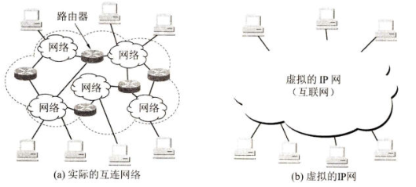

### 4.2.2 IP 地址

在 TCP/IP 体系中，IP 地址是最基本的概念。一个链接在互联网上的设备，如果没有 IP 地址，就无法和互联网上的其他设备通信。

1. IP 地址及其表示方法

整个互联网就是一个**单一的、抽象的网络**。IP 地址就是给连接到互联网上的每一个主机的每一个接口分配一个在全世界范围内是唯一的 32 位标识符。为了方便阅读，我们利用点分十进制计数法将 IP 地址表述为便于阅读的方式。

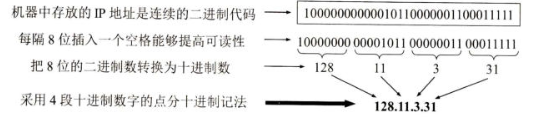

通常，IP 地址可以分为两部分：网络号、主机号。下面将讨论这个问题。

2. 分类的 IP 地址

在互联网发展早期采用的是分类的 IP 地址，如图所示。

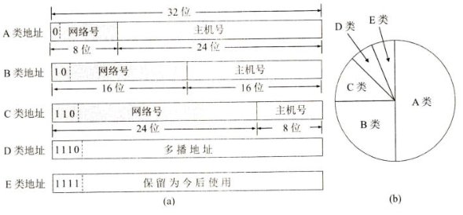

从图中可以看出，A 类地址占了 $2^{31}$ 个，也就是一半，其他的也同理。而且，只要给出一个二进制数表示的 IP 单播地址，就可以很容易的知道是哪一类地址，也能看出主机号。

A 类网络有 7 位可以表示网络号，但是全 0 的表示**本网络**，全 1 的（01111111）表示**环回测试**，留作本机进程之间通信使用。所以 A 类地址可指派的网络号有 $2^7 - 2 =126$ 个，从 1 到 127 。

A 类网络的主机号占 3 个字节，但是全 0 和全 1 一般不指派，全 0 表示本主机连接到的网络地址（比如主机的 IP 是 5.6.7.8 ，则网络地址为 5.0.0.0），全 1 表示网络上的所有主机。故每一个 A 类网络中最大主机数为 $2^{24} - 2$个

B 类网络可以指派的网络数目为 $2^{14}$ 个，每一个网络中最大主机数为 $2^{16} -2$ 个。

C 类网络可以指派的网络数目为 $2^{21}$ 个，每一个网络中最大主机数为 $2^{8} -2$ 个。

但是这样的分类会造成浪费，于是新的方法被提出。

3. 无分类编址 CIDR

无分类域间路由选择 CIDR 要点如下：

CIDR 把网络号改称为**“网络前缀”**，后面的部分仍然是主机号。CIDR 使用**斜线记法**来表示。例如，一个 IP 地址为 128.14.35.7/20，则前 20 位是网络前缀，剩下的是主机号。

CIDR 把网络前缀都相同的所有连续的 IP 地址组成一个地址块。

例如，对于 128.14.35.7/20 这一地址，我们可以得到以下信息：

但是在 CIDR 中需要区分：

- 128.14.32.7 是 IP 地址，但是未指明网络前缀长度，因此不知道网络地址。
- 128.14.32.7/20 是 IP 地址，也指明了网络前缀为 20 位，因此可以导出网络地址。

- 128.14.32.0/20 是网络前缀，也是网络中主机号全为 0 的地址。但是不能用 128.14.32.0 表明一个网络地址，因为不知道网络前缀是多少。

由于计算机无法看见斜线记法，因此是采用 32 位**地址掩码**的方法来得出网络地址。地址掩码又称为**子网掩码**，在 CIDR 记法中，斜线后的数字就是地址掩码中 1 的个数。

对于早期使用的分类 IP 地址，其地址掩码是固定的：A 类网络，地址掩码为 255.0.0.0，或者 255.0.0.0/8。B类网络，地址掩码为 255.255.0.0 或者 255.255.0.0/16。C 类地址，地址掩码为 255.255.255.0 或者 255.255.255.0/24。把二进制 IP 地址与子网掩码进行**按位与**即可得出网络地址。

此外，在 CIDR 地址中有三个特殊地址块：前缀 32 位表示主机路由，前缀 31 位表示点对点链路，前缀 0 位表示默认路由。因为 CIDR 地址块中一般包含了多个 C 类地址，因此有时也称 CIDR 编址为**“构造超网”**。

一个大的地址快中往往包含很多小地址快，因此在路由器的转发表中使用较大的 CIDR 地址块来替代较小的地址块。这一方法被称为**路由聚合**。这使得只用一个项目就可以表示原来传统分类的许多个路由项目。

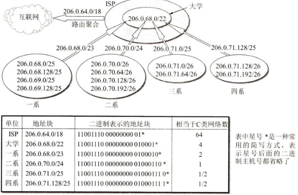

4. IP 地址的特点

- IP 地址由网络前缀和主机号两部分构成，是一种分等级的地质结构，IP 管理机构只分配网络前缀，路由器也只根据网络前缀来转发分组。
- IP 地址实际上是标志一台主机（或路由器）和一条链路的接口，如果一台主机连接到多个网络上时，就需要有多个 IP 地址。

- 有相同前缀的主机的集合就是一个网络，因此用转发器或交换机连接起来的局域网仍然是一个网络。不同网络前缀的局域网要用路由器互连。

- 互联网同等对待每一个 IP 地址。

### 4.2.3 IP 地址与 MAC 地址

MAC 地址是固化在网卡上的 ROM 中，而 IP 地址是虚拟的。

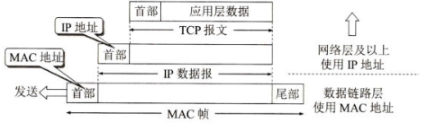

从层次的角度来看，MAC 地址是**数据链路层**使用的地址，而 IP 地址是**网络层和以上各层**使用的地址，是逻辑地址。

在上图就可以看出，虽然 MAC 地址不一样，但是在网络层看来，IP 地址是一样的。也就是说，**在 IP 层抽象的互联网上只能看到 IP 数据报**。而且，**路由器只根据目的站的 IP 地址进行转发**。

**在局域网的链路层，只能看见 MAC 帧**。IP 数据报被封装在 MAC 帧中。而在网络层上讨论问题时，因为 IP 层抽象的互联网屏蔽了细节，因此可以使用统一的 IP 地址讨论问题。

但是，还有两个问题没解决：

- 在转发的时候，主机或者路由器怎样才能知道应当在 MAC 帧的首部填入什么样的 MAC 地址？
- 路由器的转发表是如何得出的？

下面来讨论这两个问题。

### 4.2.4 地址解析协议 ARP

在实际的应用中，我们常常知道了一个 IP 地址，需要找出对应的 MAC 地址。地址解析协议 ARP 就是用来解决这样的问题。

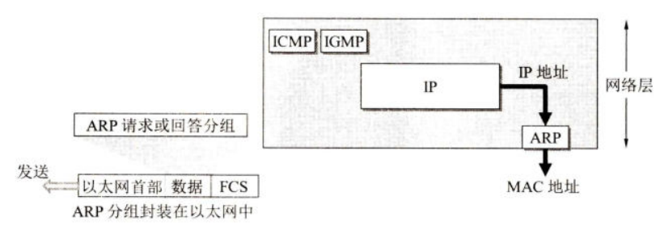

我们知道，IP 地址和 MAC 地址不存在简单的映射关系。更换网络适配器也会使主机的 MAC 地址改变。地址解析协议 ARP 解决这个问题的方法就是在主机的 ARP 高速缓存中存放一个 IP 地址到 MAC 地址的映射表，且这个映射表会动态更新。**每台主机都会设有一个 ARP Cache，里面存有本局域网上的各主机和路由器的 IP 地址到 MAC 地址的映射表**。

当主机 A 需要向本局域网中的主机 B 发送 IP 数据报的时候，先在 ARP 高速缓存中查找有无 B 的 IP 地址，如果有就在 ARP 高速缓存中找出对应的 MAC 地址，然后把 MAC 地址写入 MAC 帧，再通过局域网把 MAC 帧发向该 MAC 地址。

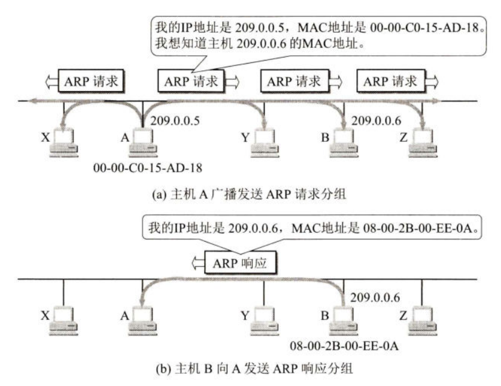

如果没有找到主机 B 的 IP 地址，主机 A 自动运行 ARP，首先在局域网上广播发送 ARP 请求分组，然后所有局域网上的主机都会收到此 ARP 请求分组。因为主机 B 的 IP 地址与 ARP 请求分组中要查询的 IP 地址一样，因此收下 ARP 请求分组，并向 A 发送 ARP 响应分组，并且在其中写入自己的 MAC 地址。这样，A 收到之后就知道 B 的 IP 地址了。

请注意，**ARP 用于解决同一个局域网上的主机或路由器的 IP 地址和 MAC 地址的映射问题**。

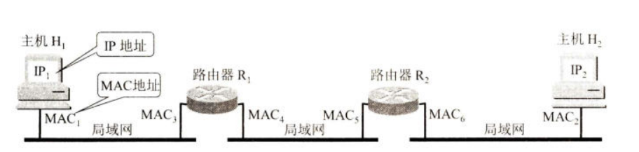

如果所要找的主机和源主机不在同一个局域网上，例如，在主机 H1 就无法解析出另一个局域网上主机 H2 的MAC 地址（实际上主机 H1 也不需要知道远程主机 H2 的 MAC 地址）。

主机 H1 发送给 H2 的 IP 数据报首先需要通过与主机连接在同一个局域网上的路由器 R1 来转发，因此主机 H1 必须知道路由器 R1 的 IP 地址。于是 H1 使用 ARP 把路由器 R1 的 IP 地址 IP3 解析为 MAC 地址 MAC3 ，然后把 IP 数据报传送到路由器 R1 以后，R1 从转发表知道应把 IP 数据报转发到路由器 R2 ，再使用 ARP 解析出 R2 的 MAC 地址 MAC5，把 IP 数据报转发到路由器 R2 。路由器 R2 用同样方法解析出目的主机 H2 的 MAC 地址 MAC2，使 IP 数据报最终交付主机 H2。

通过 IP 编址，我们使得对在不同网络之间进行不同格式的 MAC 地址转换、寻址等问题，转换成简单的 IP 地址访问问题。

### 4.2.5 IP 数据报的格式

IP 数据报的格式说明 IP 协议有什么功能。在协议 IP 的标准中，描述首部格式的宽度是 32 位，完整格式如下所示：

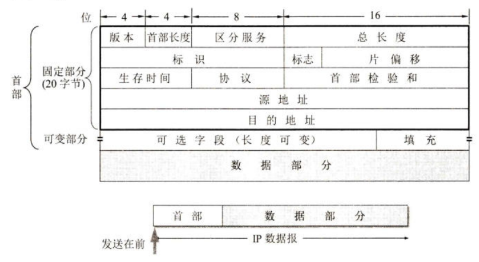

其中首部的长度是固定的，剩下的是可选字段。

1、IP 数据报首部的固定部分中的各字段。

- 版本：占 4 位，表示 IP 协议的版本。通信双方使用的 IP 协议版本必须一致。这里讨论的主要是 IPv4 。

- 首部长度：占 4 位。可表示的最大十进制长度是 15 。首部长度的单位是 32 字长（4 字节），而因为 IP 首部的固定部分是 20 字节，所以首部长度的最小值是 5；而最大值是 15， 表示首部最大有 15 个 32 字节。

- 分长度：占 8 位，用来获得更好的服务。这个字段在旧标准中叫服务类型，但是实际上一直没有被使用。

- 总长度：首部和数据之和的长度，单位为字节。总长度字段为 16 位，因此数据报的最大长度为 $2^{16} - 1 = 65535$ 字节。

  我们知道，在 IP 层下每一种数据链路层都规定了一个数据帧这种数据字段的最大长度，我们称其为最大传送单元 MCU 。那么，当数据报过长的时候就需要进行分片处理。

  在进行分片的时候，数据报中的“长度”是指**分片后每一个分片的首部长度+该分片的数据长度的总和。**

- 标识：占 16 位。IP 软件在存储器中维持一个计数器，每产生一个数据报，计数器就 +1 。当数据报超过 MTU 需要分片的时候就将其复制到所有的数据报片的标识字段中，从而能够正确的组装。

- 标志：占 3 位。但只有 2 位有意义：最低位 MF，MF = 1 的时候表示后面还有分片，否则表示这是最后一个数据报片；中间位 DF，DF = 0 的时候才允许分片。

- 片偏移：占 13 位。片偏移指出：较长的分组在分片后，某片在原分组中的相对位置。片偏移以 8 字节为偏移单位，也就是说除了最后一个数据报片之外，其他每个分片一定是 8 字节的整数倍。

  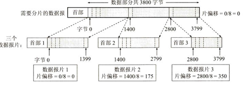

  上图的就是分三片的情况。

- 生存时间：占 8 位。在早期是指在网络中存在的秒数，但是现在 TTL 已经改为**“跳数限制”**，每次转发数据报都会让 TTL 减 1 ，当 TTL 为 0 的时候就不再转发。显然 TTL 的最大值为 255 。若 TTL 为 1，则只能在局域网内部传送。

- 协议：占 8 位。指出此数据报携带的数据使用何种协议。

- 首部检验和：占 16 位。**这个字段只检验数据报的首部，但不包括数据部分。**为了减少计算量，采用如下的计算方法：

  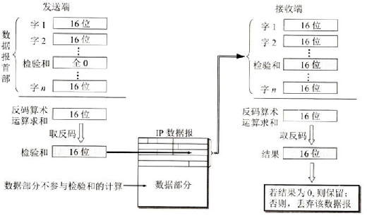

  发送方将首部划分为 16 位的序列，然后把检验和设为 0，然后对其进行**反码算术运算**。得出的 16 位结果先取反码，然后写入检验和。接收方将其再做一次反码算术运算，然后将其取反码。若首部未发生变化，则结果为 0 。

- 源地址：32 位。

- 目的地址：32 位。

## 4.3 IP 层转发分组的过程

### 4.3.1 基于终点的转发

分组在互联网上传送和转发是基于分组首部中的目的地址的，因此我们称这种方式为**基于终点的转发**。

我们知道分组每到达一个路由器，路由器就会根据终点来查找转发表，然后得知下一跳该跳转到哪个路由器。但是在路由器中，转发表**不是按照目的 IP 地址来查找下一跳的路由器的**，因为如果直接查找的话会很慢。在路由器中，通常先查找网络前缀，在找到了目的网络之后，就直接把分组在这个网络上交付给目的主机，这样可以大大压缩转发表的大小。

另一个问题是，既然分组首部中没有地方指明“下一跳的路由器的 IP 地址”，待转发的分组怎样才能找到下一跳的路由器呢？

当路由器收到一个待转发的分组，并得出下一跳的 IP 地址后，不是把这个地址填入分组首部，而是送交数据链路层的网络接口软件。它将利用 ARP 把 IP 地址转换为 MAC 地址，并将 MAC 地址放在数据链路层的 MAC 帧首部，然后利用这个 MAC 地址传送到下一跳路由器的数据链路层，然后取出 MAC 帧的数据部分，交给网络层。

而且，我们还能知道，在转发表中不能直接使用 IP 地址，而不使用 MAC 地址。

下面将通过一个示例来说明分组的转发过程。

在下面的图中，三个子网通过两个路由器连接在一起。主机 H1 发送出一个分组，其目的地址是 128.1.2.132 。现在源主机是 H1，目的主机是 H2，我们将讨论分组怎样从源主机传送到目的主机。

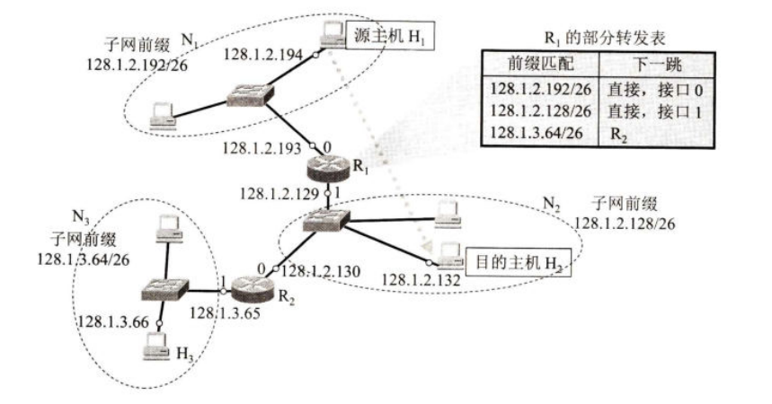

主机 H1 必须首先确定：**目的主机是否连接在本网络上？**如果是，那么直接交付；如果不是，那么要间接交付，把分组发送给连接在本网络上的路由器。

具体来说，主机 H1 首先把要发送的分组的目的地址和本网络 N1 的子网掩码按位与运算，得出运算结果。如果结果与本网络的前缀一直，就表明目的主机在本网络上；否则就要发送给路由器 R1 。

### 4.3.2 最长前缀匹配

实际上，在查找转发表的过程中，就是寻找前缀匹配的过程。

比如在下图中，路由器 R1 收到一个目的地址为 128.1.24.1 的分组，现在需要给出分组的转发接口。请注意，公司 B 包含三个子网，但这些网络前缀并没有出现在路由器 R1 的转发表中。这是因为公司 B 采用了路由聚合，把三个子网的所有地址聚合为一个网络前缀 128.1.24.0/22 。

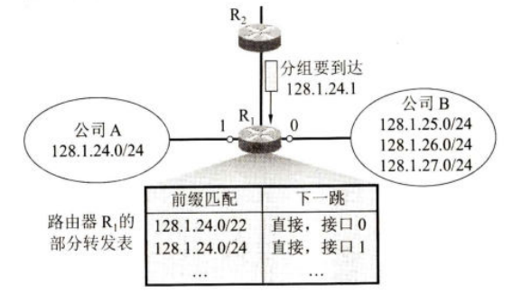

倘若在这里，我们把进入路由器 R1 的分组的目的地址分别和 R1 的转发表的第一行、第二行子网掩码进行按位与运算，我们会发现都是匹配的。那么这个时候该怎么办呢？

可以看到，128.1.24.0/22 可以划分成四个更小的 /24 前缀，其中的一个前缀 128.1.24.0/24 给了 A，剩下的三个给了 B。而 B 利用路由聚合将其合成了 128.1.24.0/22，作为 R1 中的转发表的一个项目。（虽然这里形式还是一样的，但是内容里已经有区别了）

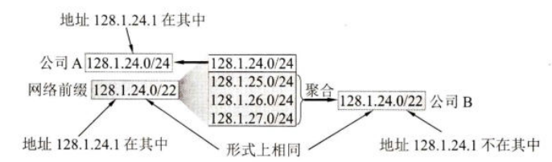

但是，在这里，第二行也能匹配成功，即使实际上并不在其中。因此，在采用 CIDR 编址的时候，**如果一个分组在转发表中可以找到多个匹配的前缀，那么应该选前缀最长的作为匹配的前缀**。这就是**最长前缀匹配**。这是因为，网络前缀越长，地址块就越小，因而路由就越具体。

除此之外，转发表中可能还会有两种特殊路由：**主机路由**（或者**特定主机路由**），是对特定主机的 IP 地址专门指明的一个路由；**默认路由**，不管分组的最终目的网络在哪，都由指定的路由器 R 来处理。

由此，可以归纳出**分组转发算法**如下：

1. **提取目的地址**：
   - 从收到的分组的首部提取目的主机的 IP 地址 D（即目的地址）。
2. **特定主机路由检查**：
   - 如果查找到有特定主机路由（目的地址为 D ），则按照这条路由的下一跳转发分组；
   - 否则，从转发表中下一行（即前缀最长的一行）开始检查，并执行步骤3。
3. **子网掩码匹配**：
   - 对这一行的子网掩码与目的地址 D 按位进行 AND 运算；
   - 如果运算结果与本行的前缀匹配，则查找结束。按照“下一跳”所指出的进行处理：直接交付本网络上的目的主机，或通过指定接口发送到下一跳路由器；
   - 否则，如果转发表还有下一行，对下一行进行检查，并重新执行步骤 3 ；
   - 如果没有更多行，执行步骤 4。
4. **默认路由处理**：
   - 如果转发表中有一个默认路由，按照指明的接口，把分组传送到指明的默认路由器；
   - 否则，报告转发分组出错。

### 4.3.3 使用二叉线索查找转发表

在使用 CIDR 之后，由于不知道目的网络的前缀，转发表的查找变得更加复杂了。在转发表中，设法缩短转发表的查找时间成为一个重要的问题。

对于无分类编址的转发表最简单的方法是顺序查找，但是这样的效率太低。通常采用把无分类编址的转发表存放在一种层次的数据结构中，然后自上而下的查找。这其中最常用的就是**二叉线索树**。

二叉线索树是一种特殊结构的树，IP 地址中从左到右的比特值决定了延伸的路径。比如下面左图中给出了 5 个 IP 地址，首先先找出他们的**唯一前缀**，然后再构造二叉树。接下来再查找的时候，只要能匹配上唯一前缀就行了。

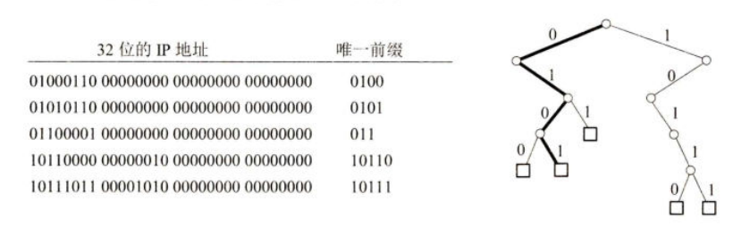

从二叉线索树的根节点自顶向下最多有 32 层，每一层对应 IP 地址中的 1 位。

假定有一个 IP 地址是10011011 01111010 00000000 00000000，需要查找该地址是否在此二叉线索中。我们从最左边查起。很容易发现，查到第三个字符（即前缀 10 后面的 0 ）时，在二叉线索中就找不到匹配的，说明这个地址不在这个二叉线索中。

## 4.4 国际报文控制协议 ICMP

为了更有效的转发 IP 数据包和提高交付的成功机会，在网际层使用了**网际控制报文协议 ICMP**。

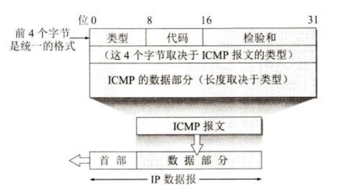

### 4.4.1 ICMP 报文的种类

ICMP 的报文分为两种，分别是 ICMP 差错报文和 ICMP 询问报文。

ICMP 报文的前 4 字节是统一的格式，共有三个字段：类型、代码和检验和。接着的 4 字节内容与 ICMP 的类型有关。最后是数据字段，其长度取决于 ICMP 的类型。

表中给出的差错报告报文共有四种：

1. 终点不可达
2. 时间超过
3. 参数问题
4. 改变路由（重定向）

所有的 ICMP 差错报告报文中的数据字段都具有同样的格式。把收到的需要进行差错报告的 IP 数据包的首部和前 8 个字节提取出来，作为 ICMP 报告报文的数据字段。再加上相应的 ICMP 差错报告报文的前 8 个字节，就构成了 ICMP 差错报告报文。

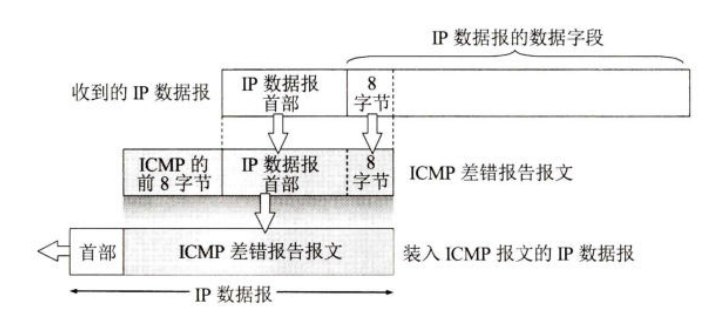

下面是不发送 ICMP 差错报告报文的几种情况：

- 对 ICMP 差错报告报文，不再发送。
- 对第一个分片的数据报片的所有后续数据报片，不再发送。
- 对具有多播地址的数据报，都不发送。
- 对具有特殊地址（如127.0.0.0）的数据报，不发送。

常用的 ICMP 询问报文有两种：

1. 回送请求或回送回答
2. 时间戳请求或时间戳回答

### 4.4.2 ICMP 应用举例

ICMP 的一个重要应用就是**分组网间探测 PING**(Packet InterNet Groper)。PING 是应用层直接使用网络层 ICMP 的一个例子，他没有通过运输层的 TCP 或者 UDP。

另一个有用的应用是 traceroute ，用来跟踪一个分组从源点到终点的路径。

## 4.5 IPv6

协议 IP 是互联网的核心协议。现在使用的 IPv4 是在 20 世纪 70 年代末期设计的，现在的 IPv4 地址已经全部耗尽了，因此开始使用 IPv6。

### 4.5.1 IPv6 的基本首部

IPv6 仍然支持无连接的传送，但是将**协议数据单元 PDU** 称为**分组**，而不是 IPv4 的**数据报**。

IPv6 有更大的地址空间，扩展的地址层次结构，灵活的首部格式，改进的选项，允许协议继续扩充，支持即插即用，支持资源的预分配。IPv6 的首部改为 8 字节对齐，而不是 IPv4 的 4 字节对齐。

IPv6 的数据报由两部分组成：**基本首部**、**有效载荷**。有效载荷也称为**净负荷**。有效载荷允许 0 个或者多个**扩展首部**。再后面是**数据部分**。但是，所有扩展首部都不属于 IPv6 的基本首部。

与 IPv4 相比，IPv6 取消了首部中不必要的功能，因此 IPv6 的字段数减少到只有 8 个。

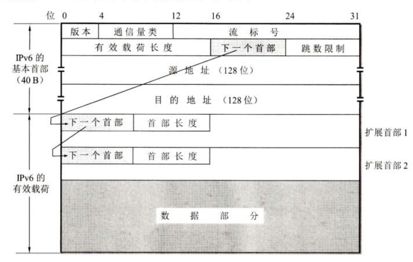

### 4.5.2 IPv6 的地址

一般来讲，一个 IPv6 数据报的目的地址可以是单播、多播、任播中的之一。 IPv6 把实现的主机和路由器均称为**节点**，会给节点的**每一个接口**指派一个 IPv6 地址。

由于 IPv6 巨大的地址范围，IPv6采用**冒号十六进制记法**来表示。例如对于地址104 . 230 . 140 . 100 . 255 . 255 . 255 . 255 . 0 . 0 . 17 . 128 . 150 . 10 . 255 . 255，可以写作68E6 : 8C64 : FFFF : FFFF : 0 : 1180 : 960A : FFFF 。在这里，允许把数字前面的 0 省略，例如上面就把 0000 前面的三个 0 省略了。

除此以外，还允许**零压缩**，即一连串连续的0允许用一对冒号取代，例如 FF05:0:0:0:0:0:0:B3 可以压缩为 FF05: :B3 。但是为了保证零压缩不混淆，规定在任一地址中只使用一次零压缩。

IPv6 取消了子网掩码。

### 4.5.3 从 IPv4 向 IPv6 过渡

向 IPv6 过渡采用逐步演进的方法。

1. 双协议栈

	双协议栈是指在完全过渡到 IPv6 之前，使一部分主机（或者路由器）同时有两种协议栈。

	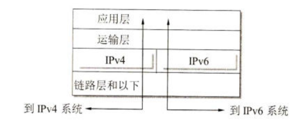

	但是采用双协议栈的代价大，因此通常采用隧道技术。

	

2. 隧道技术

	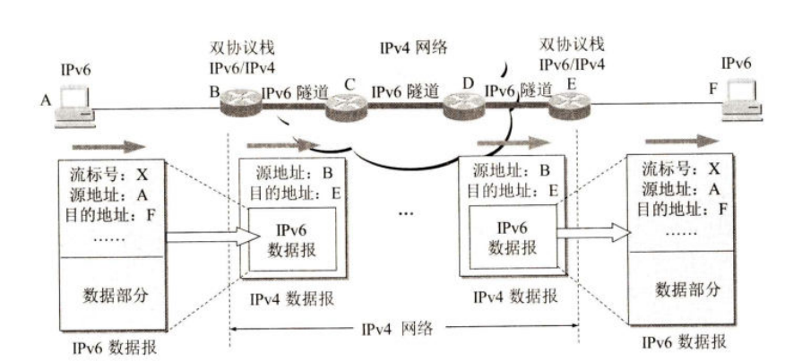

	隧道技术的要点是，当 IPv6 数据报要进入 IPv4 网络是，就把他封装成 IPv4 数据报；当离开时，再把数据部分交给主机的 IPv6 协议栈。

	

### 4.5.4 ICMPv6

和 IPv4 一样，IPv6 也不保证数据报的可靠交付，因为路由器可能会丢弃数据报，因此也需要使用 ICMP 来反馈差错信息。

新版的称为 ICMPv6，比原本的要复杂很多。

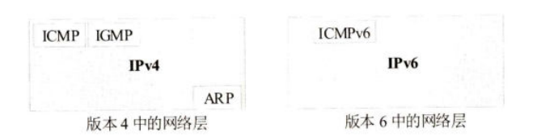

## 4.6 互联网的路由协议选择

本节将讨论几种常用的路由选择协议，也就是要讨论转发表中的路由是怎样得出的。

### 4.6.1 有关路由选择协议的几个基本概念

1. 理想的路由算法

路由选择协议的核心是路由算法。一个理想的路由算法应当有以下特点：

1、算法必须是正确的和完整的。

2、算法在计算上应简单。

3、算法应能适应通信量和网络拓扑的变化。这就是说，要有自适应性。

4、算法应具有稳定性。

5、算法应是公平的。

6、算法应是最佳的。

倘若从路由算法是否能随着网络通信量或拓扑来自适应地进行调整分化来划分，则只有两大类：静态路由选择策略、动态路由选择策略。

2. 分层次的路由选择协议

互联网采用的路由选择协议主要是自适应的、分布式的路由选择协议。互联网采用的协议是分层次的。

因此，可以把互联网划分成许多较小的**自治系统**，记为 AS 。AS 是在单一技术管理下的许多网络、IP 地址以及路由器，而这些路由器使用一种自治系统内部的路由选择协议和共同的度量。每个 AS 对其他 AS 表现出来的就是**一个单一的和一致的路由选择策略**。这样，互联网就把路由选择协议划分为两大类：

1、内部网关协议 IGP（Interior Gateway Protocol）

2、外部网关协议 EGP（Exterior Gateway Protocol）

自治系统之间的路由选择协议也叫做**域间路由选择**，而在自治系统内部的路由选择叫做**域内路由选择**。

### 4.6.2 内部网关协议：RIP 路由信息协议

RIP 协议最大的优点就是：实现简单，开销较小。

  1.  RIP 的工作原理

RIP（Routing Information Protocol）是内部网关协议 IGP 中最先得到广泛使用的协议，其中文名是**路由信息协议**。它是一种分布式的**基于距离向量的路由选择协议**。RIP 的最大优点就是简单。

RIP 要求网络中的每一个路由器都要维护从他自己到其他每一个目的网络的距离记录。因此这是一组距离，也即**距离向量**。

距离的定义是：从一路由器到直接连接的网络距离为 1 。从一主机到非直接连接的网络的距离定义为所经过的路由器数 +1 。因此，距离数也称为“**跳数**”。RIP 最大允许的跳数是 15 ，因此可见 RIP 只适用于小型互联网。

本节讨论的 RIP，以及下一节要讨论的 OSPF，都属于分布式路由选择协议。对于他们，需要掌握三个要点：**和哪些路由器交换信息？交换什么信息？在什么时候交换信息？**

对于 RIP 来说，首先，它仅和相邻路由器交换信息；其次，它交换的信息是当前本路由器所知道的全部信息，即自己的路由表；最后，它是按照固定的是时间间隔来交换。

而路由表中最重要的信息就是到某个网络的距离，以及应当经过的下一跳的地址。路由表的更新原则是找出每个目的网络的**最短距离**，下面将介绍 RIP 使用的距离向量算法。

2. 距离向量算法

对于每一个相邻路由器发来的 RIP 报文，执行以下步骤：

1. **修改接收的RIP报文**：
   - 对于来自地址为X的相邻路由器的RIP报文，进行以下修改：
     - 把“下一跳”字段中的地址全部改为X。
     - 把所有的“距离”字段的值加1。
   - 修改后，每个项目包含三个关键数据：目的网络Net，距离d，下一跳路由器X。
2. **处理修改后的RIP报文中的每个项目**：
   - 若路由表中没有目的网络Net，将该项目添加到路由表中。
   - 否则，若下一跳路由器地址为X，则用收到的项目替换路由表中的项目。
   - 若下一跳路由器地址不是X，则：
     - 如果收到的项目中的距离d小于路由表中的距离，更新路由表。
     - 否则，保持路由表不变。
3. **处理超时的路由器**：
   - 如果3分钟内未收到来自相邻路由器的更新，将该路由器标记为不可达。
   - 不可达的路由器的距离设置为16（表示不可达）。
4. **结束处理**。

上面给出的距离向量算法的基础就是 Bellman-Ford 算法（或Ford-Fulkerson 算法)。

这种算法的要点是这样的：

*设 X 是节点 A 到 B 的最短路径上的一个节点。若把路径 A → B 拆成两段路径 A → X 和 X → B ，则每一段路径 A → X 和 X → B 也都分别是节点 A 到 X 和节点 X 到 B 的最短路径。*

下面是解释：

**解释 1**：这样做是为了便于进行本路由表的更新。假设从位于地址 X 的相邻路由器发来的 RIP 报文，那么本路由器可以推断出”我经过 X 到网络 Net 的距离应该 +1“，所以要修改，作为下一步和路由表中原有项目比较时使用。

**解释 2**：表明这是新的目的网络，应当加入到路由表中。

**解释 3**：要以最新的消息为准，所以要替换。

**解释 4**：这是因为更短的距离也需要更新。

**解释 5**：若距离变大，肯定不更新。而距离不变的情况下，没有好处，所以也不更新。

例子看书上。

 1.  坏消息传播的慢

RIP 的问题是，**当网络出现故障的时候，要经过比较长的时间才能将消息传送到所有路由器**。

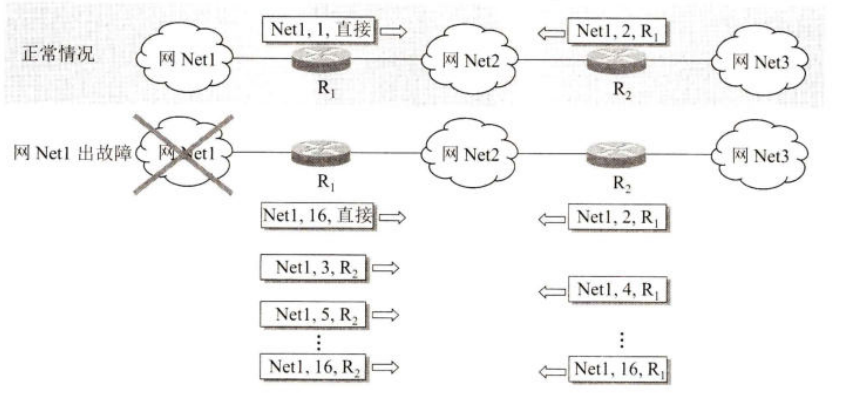

如图所示，假设这个网络中，有个网络出现了问题，那么本应该是将 R1 修改为 16，但是由于传播的延迟，实际上它会认为通过 R2 可以到达，因此会和 R2 反复发送信息，直到双方都变成 16 ，双方才会知道原来网络出现问题。

RIP 协议的这一特点为：好消息传播的快，坏消息传播的慢。

### 4.6.3 内部网关协议：OSPF 开放最短路径优先

1. 协议 OSPF 的基本特点

OSPF（Open Shortest Path First）**开放最短路径优先**是为了克服 RIP 的缺点开发的。**最短路径优先**是因为它使用了**最短路径算法 SPF** 。OSPF 只是一个协议的名字，并不代表着其他的路由选择协议不是“最短路径优先”。

OSPF 使用链路状态协议，而不是 RIP 那样的距离向量协议。对于 OSPF 的特点，有以下几条：

1、向本自治系统中的所有路由器发送信息。这里使用的方法是**洪泛法**。而 RIP 只是向相邻的路由器发送信息。

2、发送的信息就是与本路由器**相邻的所有路由器的链路状态**，但这只是路由器所知道的**部分信息**。**“链路状态”**就是说明本路由器和哪些路由器相邻，以及该链路的**”度量“**。OSPF 用**“度量”**来表示费用、距离等等，有时会称其为**“代价”**。

3、当链路状态发生变化，或者每隔一段时间，路由器向所有路由器用洪泛法发送链路状态信息。

由于各路由器之间频繁的交换链路状态信息，因此所有路由器都能建立**链路状态数据库**，也就是**全网的拓扑结构图**。这个图在全网范围内是一致的，也就是可以称为**链路状态数据库的同步**。而 RIP 尽管知道每一跳等信息，但是不知道全网拓扑结构图。而且 OSPF 的状态链路数据库的**更新过程收敛快**。

为了使 OSPF 能够用于大规模网络，OSPF 将一个自治系统再划分为若干个更小的范围，称之为**区域**。比如下图。

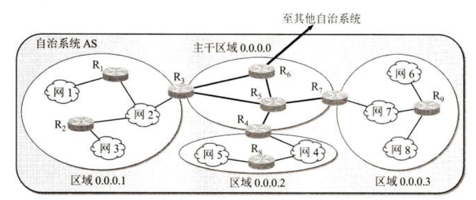

划分区域的好处就是，把利用洪泛法交换链路状态信息的范围局限于每一个区域，而不是整个的自治系统，这就减少了整个网络上的通信量。在一个区域内部的路由器只知道本区域的完整网络拓扑，而不知道其他区域的网络拓扑的情况。

为了使每一个区域能够和本区域以外的区域进行通信，OSPF 使用**层次结构的区域划分**。

在上层的区域叫作**主干区域**。主干区域的标识符规定为 0.0.0.0 。主干区域的作用是用来连通其他在下层的区域。从其他区域来的信息都由**区域边界路由器**进行概括。在图中，路由器 R3，R4 和 R7 都是区域边界路由器，而显然，每一个区域至少应当有一个区域边界路由器。在主干区域内的路由器叫作**主干路由器**，如 R3，R4，R5，R6 和 R7 。一个主干路由器可以同时是区域边界路由器，如 R3，R4 和 R7 。

在主干区域内还要有一个路由器专门和本自治系统外的其他自治系统交换路由信息。这样的路由器叫作自治系统边界路由器，如 R6 。

尽管采用分层次划分区域的方法使得交换信息的种类增多了，但是也使得每个每一个区域内部交换路由信息的通信量大大减少，因此使得 OSPF 能够应用于大规模自治系统中。

2. OSPF 的五种分组类型

1、问候分组，用来发现和维持邻站的可达性。

2、数据库描述分组，给出自己的状态链路数据库中的信息。

3、链路状态请求分组，向对方请求信息。

4、链路状态更新分组，用洪泛法对全网更新链路状态。

5、链路状态确认分组，对链路更新分组的确认。

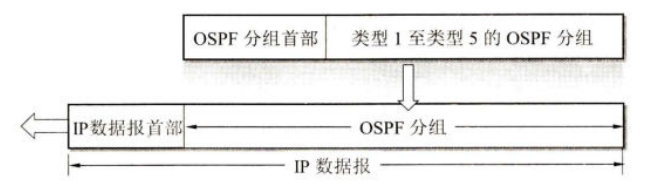

OSPF 分组是作为 IP 数据报的数据部分来传送的，不用 UDP 而**直接用 IP 数据报传送**。

OSPF 规定，每两个相邻路由器每 10s 就要交换一次问候分组来确保可达性。因此，网络中传送的绝大多数 OSPF 分组都是问候分组。如果超过 40s 没有收到某个相邻路由器发来的问候分组，就要认为他是不可达的。

当一个路由器开始工作的时候，它可以通过问候分组得知相邻的路由器在工作，以及”代价“。但是为了避免全网路由器进行广播这种开销大的方法，OSPF 使用下面的方法：

OSPF 让每一个路由器用数据库描述分组和相邻路由器交换本数据库中已有的链路状态摘要信息。摘要信息主要就是指出有哪些路由器的链路状态信息（以及其序号）已经写入了数据库。经过与相邻路由器交换数据库描述分组后，路由器就使用链路状态请求分组，向对方请求发送自己所缺少的某些链路状态项目的详细信息。通过一系列的这种分组交换，全网同步的链路数据库就建立了。

在网络运行的过程中，OSPF 使用**可靠的洪泛法**来对全网更新链路状态。

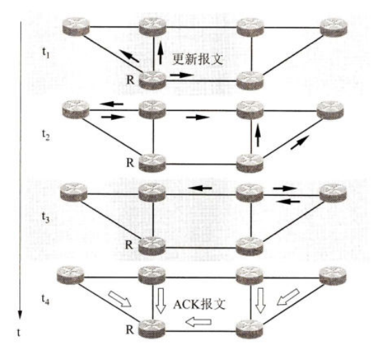

设路由器R用洪泛法发出链路状态更新分组。图中用一些小的箭头表示更新分组。第一次先发给相邻的三个路由器。这三个路由器将收到的分组再进行转发时，要将其上游路由器除外。可靠的洪泛法是在收到更新分组后要发送确认（收到重复的更新分组只需要发送一次确认）。图中的空心箭头表示确认分组。

由于一个路由器的链路状态只涉及与相邻路由器的连通状态，因而与整个互联网的规模并无直接关系。因此当互联网规模很大时，OSPF 协议要比距离向量协议 RIP 好得多。由于OSPF没有“坏消息传播得慢”的问题，据统计，其响应网络变化的时间小于100ms。

### 4.6.4 外部网关协议：BGP 边界网关协议

1. 协议 BGP 的主要特点

在外部网关协议 BGP 中，现在使用的第四个版本。

我们知道，内部网关协议是使数据在一个 AS 重尽可能有效的从源传输到目的站，但是 BGP 的使用环境不同，这是因为：

- 互联网的规模太大，使得 AS 之间路由选择变得非常困难。

- AS 之间的路由选择必须考虑有关策略，比如政治、经济等。

因此，边界网关协议 BGP 只能力求选择出一条能到达目的网络前缀且较好的路由（不兜圈子），而不是计算出一条最佳路由。BGP 采用**路径向量路由选择协议**，与距离向量路由选择协议、链路状态协议等不同。

2. BGP 路由

在一个 AS 中有两种不同功能的路由器，即边界路由器和内部路由器。一个 AS 至少要有一个边界路由器和相邻的 AS 的边界路由器直接连接。

当两个边界路由器进行通信的时候，必须先建立 TCP 连接，这种 TCP 连接又被称为半永久性连接。像 R1、R2 这种的是 eBGP 连接， e 表示外部。

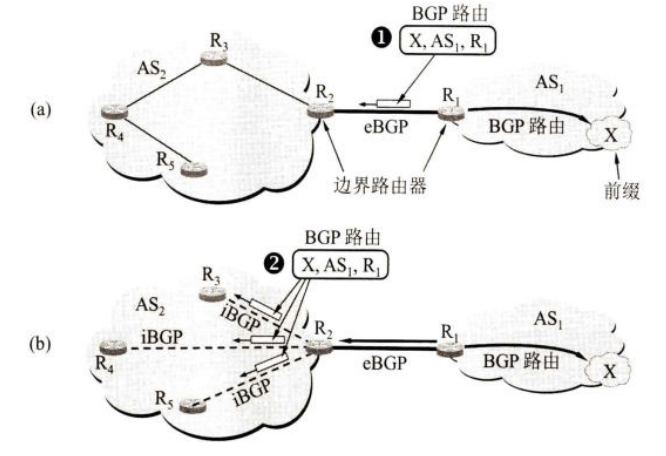

边界路由器，比如说 R2，还需要把信息转发到 AS 内部其他路由器。为此，BGP 还规定，在 AS 内部，两个路由器之间还要建立 iBGP 连接，i 表示内部。iBGP 也使用 TCP 来传输 BGP 报文。

BGP 协议规定，在一个 AS 内部的所有 iBGP 必须是**全连通**的。

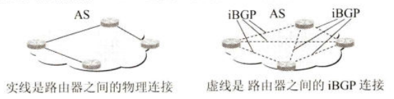

下图说明了 iBGP 和 eBGP 的作用。

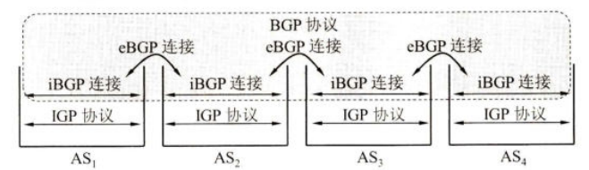

BGP 路由的一般格式是：前缀，AS-PATH，NEXT-HOP。前缀是通告 BGP 路由终点，AS-PATH 是通告 BGP 经过的自治系统，NEXT-HOP 是通告 BGP 路由起点。

对于使用 BGP 的路由器，构建转发的流程通常需要两次递归查找。首先是将路由器的起点进行转换，然后是利用内部网关协议，找到最佳路由的下一跳。

3. 三种不同的自治系统 AS

归纳起来，可以将 AS 分为三类：末梢 AS、穿越 AS、对等 AS。

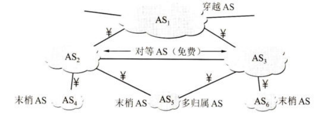

末梢 AS 是较小的 AS，这些 AS 会把分组送给其直接连接的 AS，或者从直接连的 AS 接受分组，但不会转发。末梢 AS 必须向连接的 AS 付费。

穿越 AS 是主干 AS，而对等 AS 是互相发送的。

在这里需要强调的是，为了避免兜圈子情况的出现，每次收到 BGP 路由的时候都会检查路由属性的 AS-PATH，如果多次出现了自己，那么就会认为兜圈子，应立即删除。

4. BGP 路由的选择

如果一个 AS 到另一个 AS 只有一条 BGP 路由，那么就不需要选择。

如果需要选择的话，应该按照下面的顺序：

- 本地偏好值最高的路由要首先选择
- 选择 AS 跳数最少的路由
- 热土豆算法
- BGP 标识符最小的路由

5. BGP 的四种报文

- OPEN，用来与 BGP 建立对等关系。

- UPDATE，用来通告更新。

- KEEPALIVE，保持活跃。

- NOTIFICATION，用来发送检测到的差错。

### 4.6.5 路由器的构成

1. 路由器的结构

路由器是一种专用计算机，任务是**转发分组**。从路由器某个输入端口收到的分组，按照分组要去的目的地，把该分组从路由器的某个合适的输出端口转发给下一跳路由器。下图给出了路由器的构成框图。

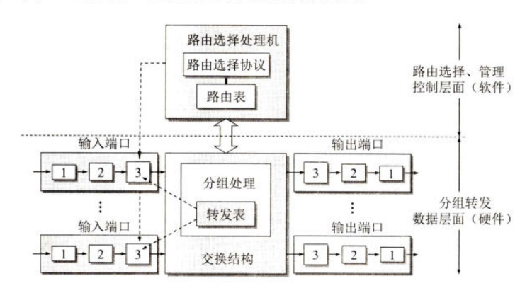

路由器的结构可以划分为两大部分：路由选择、分组转发。路由选择部分也叫做控制部分，核心构建是路由选择处理机。分组转发部分是本节要讨论的问题，也就是数据层面，它由三部分组成：交换结构、一组输入端口、一组输出端口。

交换结构也称为交换组织，他的作用是根据转发表对分组进行处理。

我们知道，路由器内部必须以很高的速度转发分组，最理想的情况是输入端口的处理速率可以跟上线路把分组传送到路由器的速率，也就是**线速**。

当一个分组正在查找转发表时，后面紧跟着从这个端口接收到的另一个分组。这个后到的分组必须在队列中等待，因而会产生时延。下图给出了在输入端口的队列中排队的示意图：

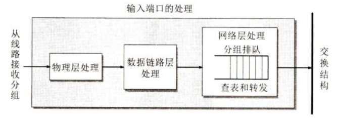

而在输出端口，从交换结构接受分组，然后把他们发送到路由器外边的线路上。在网络层的处理模块种有一个缓存区，当交换结构传送过来的分组的速率超过输出链路的发送速率的时候，来不及发送的分组必须暂时存放在这个队列中。

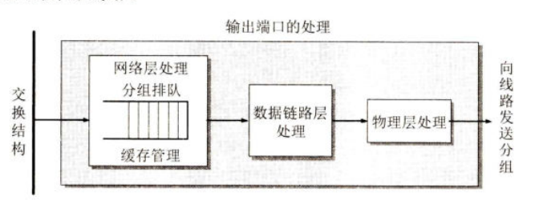

2. 交换结构

交换结构有三种常用的方法：存储器、总线、互连网络。

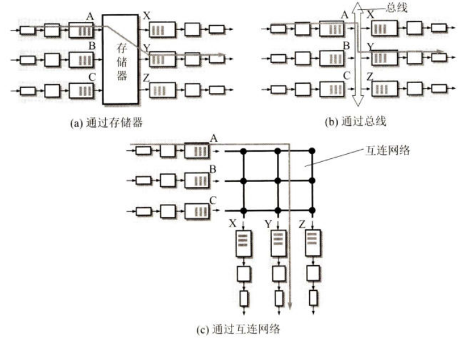

现代的许多路由器通过存储器进行交换。与早期的路由器的区别是，目的地址的查找和分组在存储器中的缓存都是在输入端口中进行的。

也有通过总线进行交换的。采用这种方式的时候，数据报从输入端口通过共享总线直接传送到合适的端口，而不需要路由选择处理机的干预。

纵横交换结构，也称为互连网络，有 2N 条总线，可以使 N 个输入端口和 N 个输出端口相互连接。

## 4.7 IP 多播

### 4.7.1 IP 多播的基本概念

当多播组的主机数很大时，采用多播的方式可以明显减轻网络中资源的消耗。

多播组的标识符就是 IP 地址中的 D 类地址，因为 D 类地址 IP 的前四位是 1110，所以D 类地址的范围是 224.0.0.0 到 239.255.255.255。多播数据报也是“尽最大努力交付”，不保证一定交付。显然多播地址之恶能用于目的地址，而不能用于源地址。另外，对多播地址不产生 ICMP 报文，因此 PING 多播地址将永远不会收到响应。

### 4.7.2 在局域网上进行硬件多播

### 4.7.3 网际组管理协议 IGMP 和多播路由选择协议

1. IP 多播需要两种协议

在传送多播信息的时候，利用 IGMP 协议，可以知道多播组成员的信息。

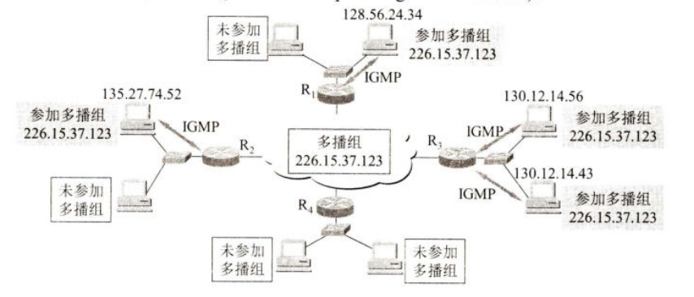

但是 IGMP 并不知道 IP 多播组包含的成员数，也不知道这些成员分布在哪些网络上。IGMP 协议是让**连接在本地局域网**上的多播路由器知道**本局域网**上是否有主机参加或者推出了某个多播组。

而只是用 IGMP 协议是无法完成多播任务的，因为连接在局域网上的多播路由器还需要与互联网上的其他路由器合作，把多播数据报传送给其他成员。因此还需要多播路由选择协议。

2. 网际组管理协议 IGMP

3. 多播路由选择协议

多播路由选择协议实际上就是要找出以源主机位根节点的**多播转发树**。

目前已有多种使用的多播路由选择协议，他们采用了以下三种方法：

1、洪泛与剪除：适用于较小的多播组。并且采用了**反向路径广播 RPB** 方法来避免兜圈子。此外，如果在多播转发树上发现它的下游树枝已没有多播组的成员，就把它和下游一起剪除。

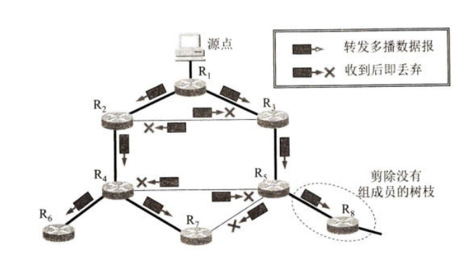

2、隧道技术

3、基于核心的发现技术

## 4.8 虚拟专用网 VPN 和网络地址转换 NAT

### 4.8.1 虚拟专用网 VPN

利用公用的互联网作为本机构各个专用网之间的通信载体，这样的专用网又称为虚拟专用网 VPN 。

### 4.8.2 网络地址转换 NAT

网络地址转换 NAT 需要在专用网连接到互联网上的路由器上安装 NAT 软件，装有 NAT 软件的路由器叫做 NAT 路由器，至少需要有一个外部的全球 IP 地址。

为了更有效地利用 NAT 路由器上的全球 IP 地址，现在常用的 NAT 转换表还会把运输层的端口号也利用上。

# 第五章：运输层

本章先概括介绍运输层协议的特点，然后重点介绍 UDP 和 TCP 协议。

本章的重点内容有：

- 运输层为相互通信的应用进程提供逻辑通信
- 端口和套接字的意义
- UDP
- TCP

## 5.1 运输层协议概括

### 5.1.1 进程之间的通信

从通信和信息处理的角度看，**运输层向它上面的应用层提供通信服务。**严格来说，两台主机进行通信就是两台主机中的应用进程互相通信。 IP 协议虽然能把分组送到目的主机，但是这个分组还是停留在网络层，而没有交付到应用进程。**通信的两端应当是两个主机的应用进程。**

因此，需要运输层来提供应用进程间的逻辑通信。

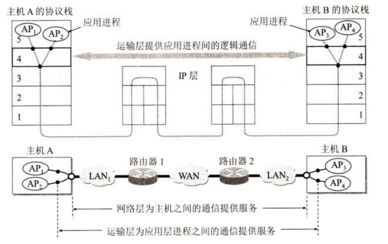

从这里也能看出，**网络层为主机之间的通信提供服务，而运输层则在网络层的基础上，为应用进程之间的通信提供服务。**

### 5.1.2 运输层的两个主要协议

TCP/IP 运输层的两个主要协议都是互联网的正式标准，即：

- 用户数据报协议 UDP （User Data gram Protocol）
- 传输控制协议 TCP（Transmission Control Protocol）

在 TCP/IP 体系中，两个对等运输实体在通信时传输的数据单位根据使用的协议是 TCP 或者 UDP，分别称为 **TCP 报文段**，或者 **UDP 用户数据报**。

UDP 不提供可靠交付，但是 UDP 非常简单。而 TCP 则提供可靠的、面向连接的服务。

### 5.1.3 运输层的端口

我们知道，应用层所有的应用进程都可以通过运输层再传送到网络层，这就是**复用**。而运输层从 IP 层收到发送给各应用进程的数据后，必须分别交付指明的各应用进程，这就是分用。

然而，把一个特定机器上运行的特定进程，指明为互联网上通信的终点是不可行的，因为进程是动态创建和撤销的，通信的一方无法知道对方机器上的进程。

解决这个问题的方法是，在应用层和运输层之间的界面上，设置一个“门”。应用层通过这些们发送到传输层，而别的主机的进程要寻找本主机的进程，也需要通过这个门。这就是**端口**。每一个端口都用一个端口号来标识。

因此，两个计算机中的进程相互通信的时候，不仅需要知道对方的 IP 地址，还需要知道对方的端口号。运输层的端口号分为下面的两大类：

1. 服务器端使用的端口号

	这里分为两类，一类是熟知端口号，从 0 - 1023，另一类是登记端口号，从 1024 - 49151 。

	

2. 客户端使用的端口号

	数值为 49152 - 65535 。这类是动态选择的端口号。

## 5.2 用户数据报协议 UDP

### 5.2.1 UDP 概述

UDP 在 IP 的基础上增加了复用和分用，以及差错检测。UDP 是**无连接的**，**尽最大努力交付**。同时，它是面向报文的，对于应用层交下来的报文，既不合并，也不拆分，而是**保留这些报文的边界**。除此以外，UDP **没有拥塞控制**。UDP 的首部开销小，只有 8 个字节，比 TCP 的 20 字节首部要短。

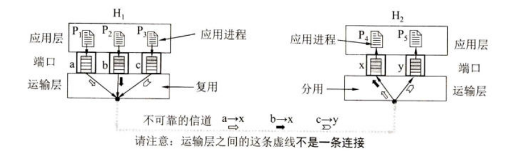

上面的图展示了 UDP 的**复用**和**分用**。

### 5.2.2 UDP 的首部格式

用户数据报 UDP 有两个字段：数据字段和首部字段。首部字段只有 8 个字节，由四个字段组成，**每个字段的长度都是 2 字节**：

- 源端口：在需要对方回信时使用，不需要时可以全 0 。
- 目的端口：在终点交付报文的时候必须使用。
- 长度：UDP 用户数据报长度，最小值是 8 。
- 检验和

其中，UDP 计算检验和的方法和计算 IP 数据报首部检验和的方法类似，但是不同的是： IP 数据报的检验和发送只检验 IP 数据报的首部，但 UDP 的检验和是**把首部和数据部分一起检验**。过程如下图所示：

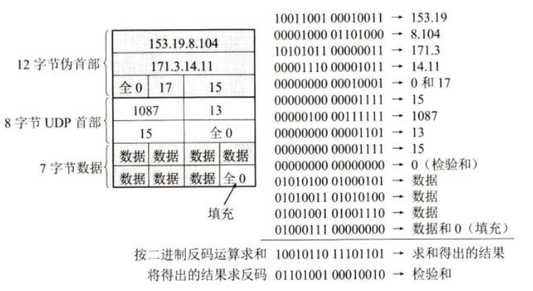

在发送方，首先把将检验和全部设 0 ，然后把伪首部和 UDP 用户数据报看成由许多 16 位字串接起来的。若 UDP 用户数据报的数据部分不是偶数字节，则需要填充一个全 0 字节。然后按照二进制反码计算 16 位字的和。在求和过程中，任何溢出（也就是超过16位的部分）会被回绕，即加回到最低位。

而在接收方，将收到的 UDP 用户数据报、伪首部、以及可能的填充字节一起，用二进制反码加法求这 16 位字的和，如果无差错的时候结果应为全 1 。

## 5.3  传输控制协议 TCP 概述

### 5.3.1 TCP 最主要的特点

TCP 是**面向连接的运输层协议**，每一条 TCP 连接**只能有两个端点**。 TCP **提供可靠交付的服务**，也提供**全双工通信**。

TCP 是面向字节流的。也就是说，虽然应用程序和 TCP 的交互是一次一个数据块，但是 TCP 把应用程序交下来的数据仅仅看为一连串的无结构字节流。TCP 不知道所传送的字节流的含义，不保证接收方应用程序收到的数据块和发送方应用程序所发出的数据块有对应大小的关系。如下图所示：

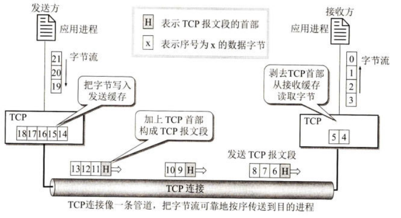

TCP 是一条虚连接，也就是逻辑连接，而不是物理意义上的连接。

### 5.3.2 TCP 的连接

TCP 把连接作为最基本的抽象。每一条 TCP 连接有两个端点，这两个端点是**套接字（socket）**。所谓的套接字就是端口号拼接到 IP 地址，比如 IP 地址是 192.3.4.5 而端口是 80，则套接字是 192.3.4.5 : 80。

同一个 IP 地址可以有很多不同的 TCP 连接，同一个端口号也可以出现在多个不同的 TCP 连接中。

## 5.4 可靠传输的工作原理

我们知道，TCP 的报文是交给 IP 层处理的，但是 IP 层并不保证可靠交付，因此 TCP 需要采用一定的措施才能实现可靠通信。在实际的网络中，常常采用可靠传输协议，当出现差错时让发送方重传出现差错的数据，同时在接收方来不及处理收到的数据时，即使告诉发送方适当降低发送数据的速率。

### 5.4.1 停止等待协议

所谓的停止等待就是每发送完一个分组，就停止发送，等待对方的确认，在收到确认后，再发送下一个分组。下面展现的是自动重传请求 ARQ 的协议的情况：

1. 无差错情况

	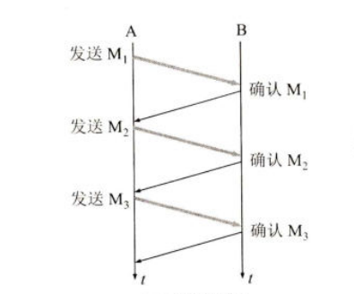

	

2. 出现差错

	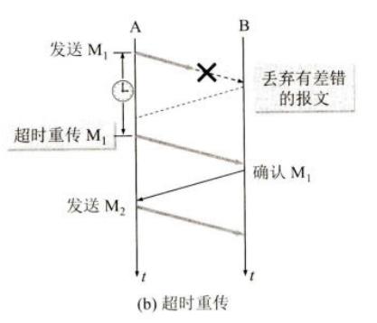

	要实现超时重传，就要在每发送完 一个分组时，设置一个超时计时器。一般来说，超时计时器设置的重传时间应当比数据在分组传输的平均往返时间要更长一些。

	

3. 确认丢失和确认迟到

	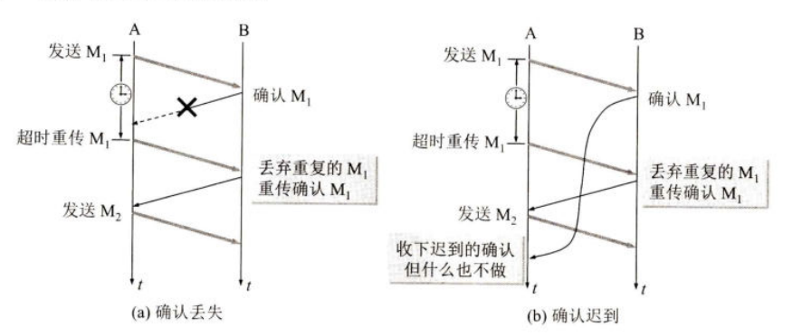

	

4. 信道利用率

	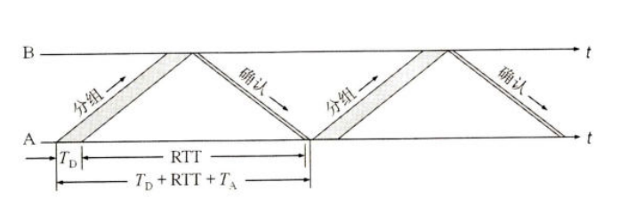

	停止等待协议的信道利用率太低，因此可以利用连续 ARQ 协议来提高利用率。

	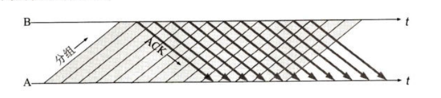

### 5.4.2 连续 ARQ 协议

下图表示的是发送方维持的发送窗口：

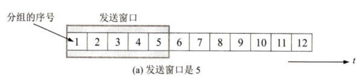

它的意义是：位于发送窗口内的 5 个分组都可以发送出去，而不需要等待对方的确认，这样信道利用率就高了。

连续 ARQ 协议在发送方每收到一个确认的时候，就把发送窗口向前滑动一个分组的位置，如下图：

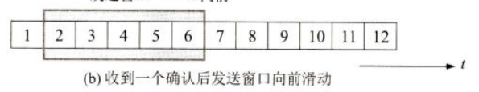

在接收方一般采用**累积确认**的方式，不对收到的分组逐个确认，而是收到几个分组后，**对最后一个到达的分组发送确认**。

但是，累积确认没法及时反映已经正确收到所有分组的信息。

## 5.5 TCP 报文段的首部格式

在探讨 TCP 的可靠传输问题之前，需要先了解 TCP 报文段首部的格式。

虽然 TCP 是面向字节流的吗，但是其传送的数据单元却是报文段。一个 TCP 报文段分为首部和数据两部分。其首部前 20 字节是固定的，后面有 $4n$ 字节是根据需要而增加的。

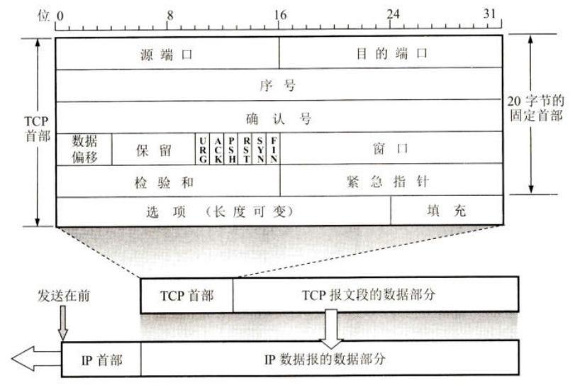

其首部固定部分各字段及其意义如下：

- 源端口：2 字节。
- 目的端口：2 字节。
- 序号：4 字节。在 TCP 连接中传送的字节流的**每一个字节都按顺序编号**。因此首部中给出的序号字段是指**本报文段发送的数据的第一个字节的序号**。
- 确认号：4 字节。是**期望收到对方下一个报文段的第一个数据字节的序号**。若确认号 = N，则表明到序号 N-1 位置的所有数据都正确收到了。
- 数据偏移：4 位。
- 保留：6 位。
- 紧急 URG、确认 ACK、推送 PSH、复位 RST、同步 SYN、终止 FIN。
- 窗口：2 字节。窗口字段指出了现在允许对方发送的数据量。
- 检验和：2 字节。
- 紧急指针：2 字节。仅当 URG = 1 的时候才有意义。
- 选项：长度可变，最长 40 字节。TCP 最初只规定了一种选项：最大报文长度 MSS。MSS 是指每一个 TCP 报文段中**数据字段**的最大长度。

## 5.6 TCP 可靠传输的实现

### 5.6.1 以字节为单位的滑动窗口

TCP 的滑动窗口是以字节为单位的。

在下图中，假定窗口是 20 字节，确认号是 31，那么发送端 A 可以构造出的自己的发送窗口：

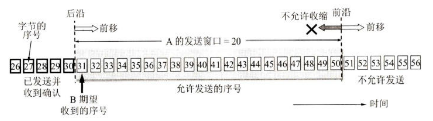

发送窗口表示，在没有收到接收方确认的情况下，发送方可以连续把发送窗口内的数据都发送出去。凡是已经发送的数据，在未确认之前都要暂时保留，以便超时重传时使用。

发送窗口的前后都可以变化。

要描述一个发送窗口的状态需要三个指针：

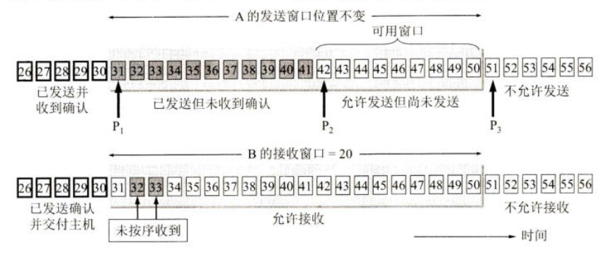

在下图中，给出了发送方维持的发送缓存、发送窗口，接收方的接收缓存、接收窗口。

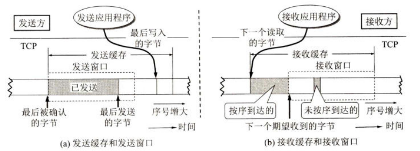

需要知道，缓存空间和序号空间都是有限的，并且都是循环使用的。发送缓存用来存放发送应用程序传送给发送方 TCP 准备发送的数据，以及 TCP 已发出但是接收方尚未确认收到的数据。由于发送窗口时发送缓存的一部分，因此发送缓存和发送窗口的后部是重合的。

而接收缓存用来存放按序到达的、但尚未被接收应用程序读取的数据，以及未按序到达的数据。如果接收到的分组有差错，则需要丢弃。如果接收应用程序来不及读取，则接收缓存会慢慢被填满。

虽然发送窗口是根据接收窗口设置的，但是发送窗口并不总是和接收窗口一样大，这是因为网络是有时延的。第二，对于不按序到达的数据，通常是将其先临时存储在接收窗口中，当收到缺少的字节厚，再交付上层的应用进程。第三，TCP 要求接收方必须有累积确认的功能，这样可以减少传输开销。

### 5.6.2 超时重传时间的选择

虽然重传的概念很简单，但是重传时间的选择是 TCP 最复杂的问题之一。

TCP 现在采用了一种自适应算法，记录一个报文段发出的时间，以及收到对应的确认的时间。这两个时间差记为**报文段往返时间 $RTT$** ，而 TCP 采用的是加权平均往返时间 $RTT_S$ 。每当观测到 $RTT$ 样本的时候，就需要更新 $RTT_S$，使用以下公式：
$$
RTT_S = (1- \alpha ) * (RTT_S) + \alpha *(RTT)
$$
在目前，$\alpha = 0.125$ 。

显然，超时重传时间 $RTO$ 应略大于上面得到的 $RTT_S$ 。使用下面公式：
$$
RTO = RTT_S + 4*RTT_D
$$
其中，$RTT_D$ 是 $RTT$ 的**偏差**的加权平均值。第一次测量时，$RTT_D$ 的值应该是 $RTT$ 的值的一半，然后之后的计算公式如下：
$$
RTT_D = (1-\beta ) * ( RTT_D ) + \beta * |RTT_S - RTT|
$$
在目前，$\beta = 0.25$ 。

但是这一方法，在出现下面的情况时，无法确认：收到的确认报文到底是对先发送的报文的确认，还是对后来重传的报文的确认？

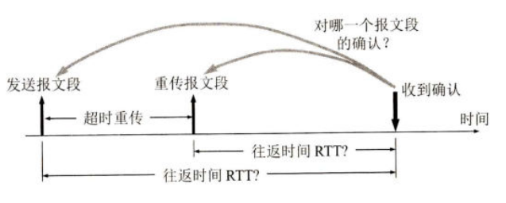 

因此，Karn 提出，在计算加权平均 $RTT_S$ 的时候，如果报文段重传了，则不用其作为往返时间样本。但是这样也会存在问题。因此修正后的方法是：报文段每重传一次，就把 RTO 增大一些。典型的做法是取新的重传时间是旧的重传时间的两倍。当不再发生重传的时候，才会用上面的公式计算 $RTO$ 。

### 5.6.3 选择确认 SACK

在这里有个问题：如果收到的报文段无差错，只是未按照序号收到，且中间缺少一些序号的数据，那么是否可以只传送缺少的数据？

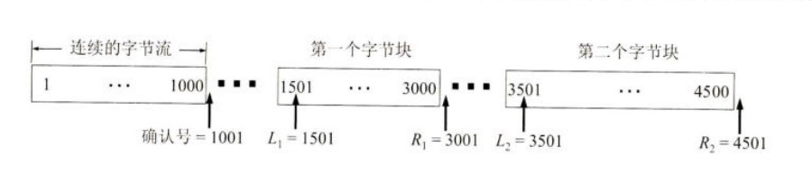

利用**选择确认 SACK**是一种可行的处理方法。

1. **不采用 SACK**：TCP 仅使用累积确认机制。即使收到更高序号的数据，如果中间缺少某些数据，接收端只能确认最后一个连续收到的数据段的序号。这可能导致发送端重传已成功接收但序号较低的数据段。
2. **采用 SACK**：接收端可以显式地告知发送端哪些数据段已被接收，即使它们是非连续的。发送端只需要重传那些未被确认的数据段，而不是所有累积确认点之后的数据。这样，即使数据包未按顺序到达，也可以减少不必要的重传，提高效率。

然而，SACK 文档中没有明确指出发送方应当怎样响应，因此大多数重传的实现还是重传所有未被确认的数据块。

## 5.7 TCP 的流量控制

### 5.7.1 利用滑动窗口实现流量控制

所谓的流量控制，就是让发送方不要发送太快，而接收方要来得及接收。下面的例子展示了如何利用滑动窗口进行流量控制：

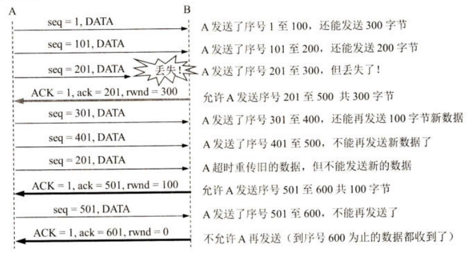

1. **窗口大小**：滑动窗口的大小决定了发送端在等待确认之前可以发送多少数据。这个大小由接收端根据其当前的缓冲区容量动态指定，通过 TCP 报文段中的窗口大小字段告知发送端。
2. **调整窗口**：接收端根据自己的处理能力和缓冲区空间调整窗口大小，并通过 ACK 报文段发送给发送端。发送端根据这个窗口大小调整其发送速率。
3. **防止网络拥堵**：当网络状况不佳或接收端处理能力下降时，接收端会减小窗口大小，从而减少发送端的数据发送速度，防止网络拥堵。
4. **窗口滑动**：随着数据的成功传输和确认，窗口会向前滑动，允许发送更多的数据。这个过程持续进行，直到所有数据都被成功发送和确认。

### 5.7.2 TCP 的传输效率

在 TCP 中，有很多不同的机制来控制 TCP 报文的发送实际。通常，使用 Nagle 算法。这个算法通过累积小数据片段，直到积累到一定大小或收到之前数据包的确认后再一起发送。虽然这种方法能显著减少网络负载，但也可能增加数据传输的延迟，特别是在交互式应用中。在默认情况下，所有 TCP 连接都会使用 Nagle 算法，但在需要实时数据传输的应用中，有时会禁用它。

另一个问题是**糊涂窗口综合征**。糊涂窗口综合征（Silly Window Syndrome）是 TCP/IP 网络通信中的一个问题，它发生在数据传输过程中。这个问题涉及到不合理的小数据块的频繁发送，导致网络效率降低。具体来说，糊涂窗口综合征可能由以下两种情况导致：

1. **发送端**：如果发送端应用程序频繁地发送小量数据，而不是等待有足够数量的数据后再发送，这将导致网络被大量小数据包占据，使网络利用率降低。
2. **接收端**：如果接收端的 TCP 提示发送端其可接收的窗口很小，使得发送端只能发送小量数据，这也会导致类似的效率问题。

为了解决糊涂窗口综合征，可以让**接收方等待一段时间**，使得接收缓存有足够的空间容纳一个长报文段，或者**等到接收缓存已有一半空闲的空间**。只要出现其中的一种情况，接收方就发出确认报文，并通知发送方当前窗口大小。

## 5.8 TCP 的拥塞控制

### 5.8.1  拥塞控制的一般原理

在计算机网络中，网络的资源是有限的。因此当对资源的需求超过可用资源的时候，网络就会发生堵塞。而且，网络堵塞的原因很多，因此需要一些控制。

拥塞控制和流量控制的关系密切。

所谓拥塞控制就是**防止过多的数据注入到网络中，这样可以使网络中的路由器或者链路不至于过载**。它的前提是**网络能够承受现有的网络负荷**。拥塞控制是一个**全局性**的过程。

而流量控制往往是指**点对点通信量的控制**，是**端到端**的问题。

下图给出了两个的解释：

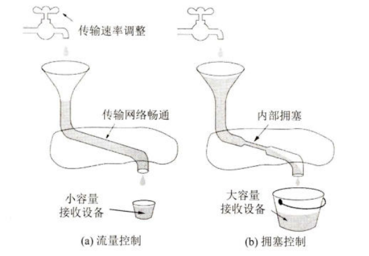

1. **流量控制（图5-22(a)）**：比喻中，水桶太小，无法及时接收流入的水。因此，需要减缓水流的速度（即拧小水龙头），以避免水溢出水桶。在网络中，这对应于接收端的缓冲区容量有限，因此发送端需要减慢发送速度以防止数据丢失。
2. **拥塞控制（图5-22(b)）**：虽然水桶足够大，但水管中有狭窄的地方导致水流不畅，引发堵塞。在这种情况下，减缓水流速度的目的是为了缓解水管的堵塞。在网络中，这对应于整个网络中的拥塞现象，需要减慢数据的发送速率以减轻网络拥堵。

对于拥塞控制来说，具有理想控制拥塞的网络在吞吐量超过某一个限度的时候就会不再增长。

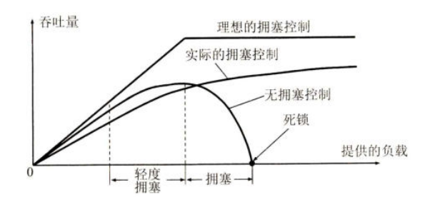

但是实际的情况却不同。随着网络负载的增大，增长速率逐渐减小，也就是说在网络吞吐量还未饱和的时候，就已经有一部分的输入分组被丢弃了。

而没有拥塞控制的网络，当网络的吞吐量明显小于理想吞吐量的时候，网络进入**轻度拥塞**的阶段。在网络的吞吐量随着提供负载的增大而下降的时候，**就已经进入拥塞状态了**。在负载达到一定数值之后，就进入了**死锁**。

### 5.8.2 TCP 的拥塞控制方法

TCP 有四种方法进行拥塞控制：慢开始、拥塞避免、快重传和快恢复。

我们讨论的拥塞控制也叫**基于窗口的拥塞控制**，因此发送方需要维持一个名为“**拥塞窗口 CWND（Congestion Window）**”的变量。拥塞窗口的大小取决于网络的拥塞程度。而**发送方让自己的发送窗口 = 拥塞窗口**。对于拥塞窗口，发送方会让其尽可能增大，只要网络不出现拥塞。而当发送方在超时重传计时器启动的时候，就判断出现了网络拥塞。

下面将从“慢开始算法”开始，讨论拥塞窗口 cwnd 是怎样变化的。

**慢开始算法的思路**是这样的：当主机在已建立的 TCP 连接上开始发送数据时，并不清楚网络当前的负荷情况。如果立即把大量数据字节注入到网络，那么就有可能引起网络发生拥塞。经验证明，较好的方法是先探测一下，即由小到大逐渐增大注入到网络中的数据字节，也就是说，由小到大逐渐增大拥塞窗口数值。

慢开始算法规定，在每收到一个对新的报文段的确认后了，可以把拥塞窗口增加最多一个**发送方最大报文段 SMSS** 的数值。更具体来说，应该是 $增加量 = min(原先未被确认但是现在刚收到的确认报文段锁确认的字节数，SMSS)$ 。

为了防止拥塞窗口 cwnd 增长过大引起网络拥塞，还需要设置一个**慢开始门限 ssthresh** 。慢开始门限的用法如下：

- 当 cwnd $<$ ssthresh 的时候，使用慢开始算法；
- 当 cwnd $>$ ssthresh 的时候，使用**拥塞避免**算法；
- 当 cwnd $=$ ssthresh 的时候，两者皆可；

上面提到的**拥塞避免**算法的目的是让拥塞窗口 cwnd 缓慢的增大。当使用拥塞避免算法的时候，每经过一个往返时间 RTT，cwnd 就增加 1，而不是像慢开始算法那样成倍增长。因此在拥塞避免阶段称为**“加法增大” AI**（Additive Increase）。这样增长速率就慢很多了。

可以用曲线说明 TCP 的拥塞窗口 cwnd 是怎样随时间变化的。

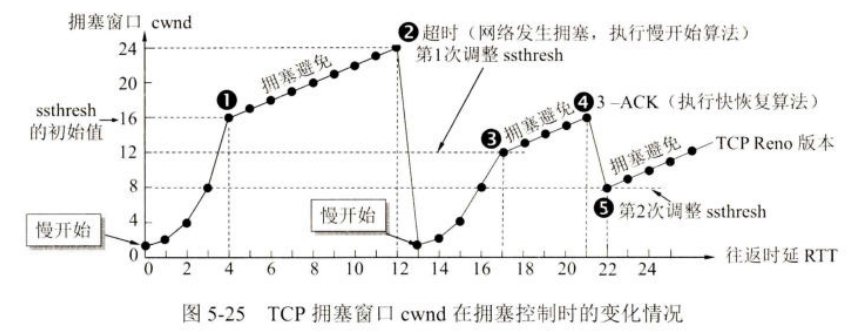

有时，尽管网络并未拥塞，但是因为报文段丢失，发送方迟迟收不到确认，因此误认为产生超时，从而将 cwnd 又设置为 1 。

采用**快重传**算法可以让发送方**尽早知道发生了个别报文段的丢失**。快重传算法要求接收方不要等待自己发送数据的时候捎带确认，而是**立即确认**，即使收到了失序报文段也要对发出对已收到的报文段的重复确认。

比如上图，当发送方收到对同一个数据包的三个重复确认时，它会立即重传该数据包，而不是等待超时重传计时器到期。

因此，在图 5-25 的 ④ 处，发送方知道只是丢失个别的报文段，因此不会启动慢开始算法，而是启动**快恢复**算法。它是在快重传算法之后使用的，用于在发生丢包后快速恢复。在快恢复算法中，TCP 不会像在慢开始算法中那样将拥塞窗口减少到 1，而是将拥塞窗口减半，然后进入拥塞避免阶段，线性增加拥塞窗口的大小。

综上所述，TCP 的拥塞控制流程图可以总结为如下：

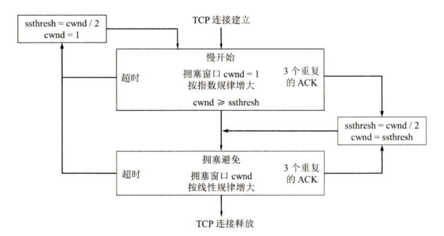

### 5.8.3 主动队列管理 AQM 

TCP 的拥塞控制和网络层采取的联系也有密切的关系。

网络层的策略对 TCP 拥塞控制影响最大的就是路由器的分组丢弃策略。在最简单的情况下，路由器队列按照“**先进先出**”的原则来处理。而当队列已满时，以后再到达的所有分组都将被丢弃，被称为**尾部丢弃策略**。

路由器的尾部丢弃会导致一连串分组的丢失，这就是发送方出现超时重传，使得 TCP 进入拥塞控制的慢开始，这会让发送突然降速。

为了避免这种情况，在 1998 年提出了主动队列管理 AQM（Active Queue Management）。所谓“主动”就是不等到路由器达到队列长度已经达到最大值时才不得不丢弃后面到达的分组。AQM 有不同的实现方法，其中曾流行多年的就是**随机早期检测 RED（Random Early Detection）**。

RED 不是等到已经发生网络拥塞后才把所有在队列尾部的分组全部丢弃，而是在检测到网络拥塞的**早期征兆**（也就是路由器的平均队列长度达到一定数值的时候），就以概率 $p$ 丢弃个别的分组，让拥塞控制在个别 TCP 连接上进行，避免发生全局性的拥塞控制。

RED通过提供更早的拥塞反馈，帮助TCP更有效地调整其发送速率，从而提高整体网络效率和稳定性。

## 5.9 TCP 的运输连接管理

TCP 是面向连接的协议。运输连接是用来传送 TCP 报文的。TCP 运输连接的建立和释放时每一次面向连接的通信必不可少的过程。因此，运输连接有三个阶段：**连接建立**、**数据传送**和**连接释放**。

### 5.9.1 TCP 的连接建立

TCP 建立连接的过程叫做握手，握手需要在客户和服务器之间交换三个 TCP 报文段。

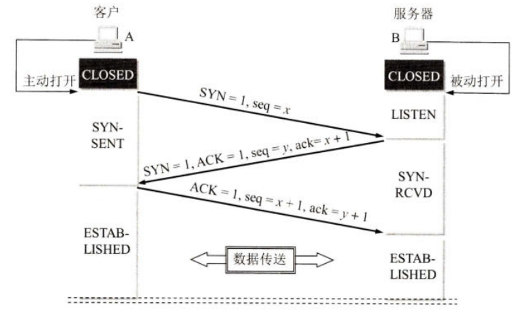

TCP 连接建立过程（三次握手）的步骤如下：

1. **建立传输控制块**：
   - 服务器（B）创建传输控制块 TCB，并进入 LISTEN 状态，等待客户端的连接请求。
   - 客户端（A）也创建传输控制块 TCB，并准备建立连接。

2. **发起连接请求**：
   - A 向 B 发送连接请求报文段，其中 $SYN=1$，选择初始序号 $seq=x$ 。SYN 报文段不能携带数据，但消耗一个序号。
   - A 进入 SYN-SENT 状态。

3. **确认连接请求**：
   - B 收到连接请求后，若同意建立连接，则发送确认。确认报文段中 SYN 和 ACK 都置为 1，确认号 $ack=x+1$，选择初始序号 $seq=y$。
   - 此报文段也不携带数据，但消耗一个序号。B 进入 SYN-RCVD 状态。

4. **最终确认**：
   - A 收到 B 的确认后，再次向 B 发送确认，ACK 置 1，确认号 $ack=y+1$，序号 $seq=x+1$。
   - ACK 报文段可以携带数据，但若不携带则不消耗序号。A 进入 ESTABLISHED 状态。

5. **连接建立**：
   - B 收到 A 的最终确认后，也进入 ESTABLISHED 状态，完成连接建立。

这个三次握手过程确保了双方都准备好进行通信，从而有效地建立 TCP 连接。

### 5.9.2 TCP 的连接释放

TCP 的连接释放过程更复杂一些。在通信结束后，双方都可以释放连接。

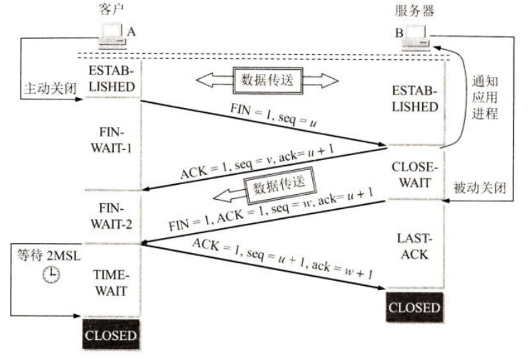

1. **初始状态**：
   - A 和 B 都处于 ESTABLISHED 状态。

2. **A 发起连接释放**：
   - A 向 B 发送带有 FIN 标志的报文段（$seq=u$），表示无更多数据发送，并进入 FIN-WAIT-1 状态。

3. **B 确认接收**：
   - B 收到 A 的 FIN 报文段后，发送 ACK 报文（$ack=u+1$，$seq=v$），进入 CLOSE-WAIT 状态。

4. **A 等待 B 的终止请求**：为什么A在TIME-WAIT状态必须等待2MSL的时间呢?
   - A 收到 B 的 ACK 后，进入 FIN-WAIT-2 状态，等待 B 的连接释放报文段。

5. **B 结束数据传输**：
   - B 发送带有 FIN 标志的报文段（$seq=w$，$ack=u+1$），进入 LAST-ACK 状态。

6. **连接结束**：
   - A 收到 B 的 FIN 报文段，发送 ACK（$ack=w+1$，$seq=u+1$），进入 TIME-WAIT 状态。经过 2MSL 后，进入 CLOSED 状态。
   - B 收到 A 的 ACK 后，直接进入 CLOSED 状态。

这个过程确保双方都正确结束数据传输，防止已失效的连接请求报文段影响新连接，以及确保 B 正确进入 CLOSED 状态。

而在这里，A 在 TIME-WAIT 状态必须等待 2MSL（Maximum Segment Lifetime，最长报文段生存时间）的时间有两个主要原因：

1. **确保最后一个 ACK 报文段能够到达 B**：如果这个 ACK 报文段在传输过程中丢失，B 将无法收到对其 FIN+ACK 报文段的确认。因此，B 会重传 FIN+ACK 报文段。A 在 2MSL 的时间内可以收到这个重传的报文段并再次发送 ACK 报文段。这样可以确保两端都能够正常进入 CLOSED 状态。
2. **防止“已失效的连接请求报文段”影响新连接**：2MSL 的等待时间可以确保本次连接产生的所有报文段都从网络中消失。这样，下一个新的连接中不会出现旧连接的报文段，避免潜在的报文段混淆或错误。

### 5.9.3 TCP 的有限状态机

为了更清晰的看出 TCP 连接的关系，下面给出了 TCP 连接的有限状态机。

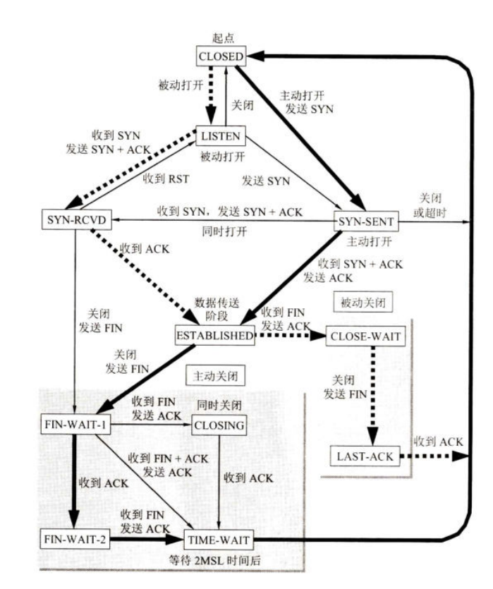

- 图中的每个方框代表 TCP 可能的一个状态，方框中的大写英文字母是 TCP 标准中使用的状态名称。
- 状态之间的箭头表示可能发生的状态转变。箭头旁的文字说明了引发状态变迁的原因，或者在状态变迁后会发生的动作。
- 图中有三种不同类型的箭头：
	- 粗实线箭头代表对客户进程的正常状态变迁。
	- 粗虚线箭头代表对服务器进程的正常状态变迁。
	- 细线箭头表示异常状态变迁。

# 第六章：应用层

前面的章节中，已经讨论了计算机网络提供通信服务的过程，但是还没有讨论通信服务是如何被应用进程使用的。本章将讨论各种应用进程通过什么样的应用层协议来使用网络提供的服务。

我们知道，运输层为应用进程提供了端到端的通信服务，但是在不同网络的应用进程之间，也要有不同的通信规则。因此在运输层协议之上还要有**应用层协议**。应用层协议需要精确定义通信规则，比如应用进程交换的报文类型、报文类型的语法、字段的语义、如何发送和响应进程等。

应用层协议是网络应用的一部分，但不是全部。他们定义了数据的传输方式，但不涉及如何展示数据或应用内部的运作。多数应用层协议基于 C/S 模型。

本章的重点内容有：

- 域名系统 DNS
- 万维网和 HTTP 协议
- 电子邮件的传送过程，SMTP、POP3、IMAP协议
- 动态主机配置协议 DHCP
- 网络管理的三个组成部分：SNMP、SMI、MIB
- P2P 文件系统

## 6.1 域名系统 DNS

### 6.1.1 域名系统概述

**域名系统 DNS**（Domain Name System）是互联网使用的命名系统，用来把便于人类记忆的机器名字转换为 IP 地址。

用户与互联网上某台主机通信的时候，必须要知道对方的 IP 地址。然而 32 位的 IP 地址不便于记忆。在应用层，为了方便用户记忆，连接在互联网上的主机还有主机名。DNS 就是用来把主机名转换成 IP 地址的。

如今，**互联网采用的是层次树状结构命名的方法，并且采用分布式 DNS** ；域名到 IP 地址的解析也是由分布在互联网上的许多**域名程序服务器程序**共同完成的，而人们也常把运行域名服务器程序的机器叫做**域名服务器**。

简单来说，当一个应用进程需要把主机名解析为 IP 地址的时候，应用进程调用**解析程序**，成为 DNS 客户，然后把需要解析的域名放入 DNS 请求报文中，通过 UDP 协议将其发送到本地域名服务器。本地域名服务器查找对应的 IP 地址，并将其放入回答报文中返回给应用进程。这样应用进程在收到 IP 地址之后，就可以与目标主机进行通信。

### 6.1.2 互联网的域名结构

现在互联网采用了层次树状结构的命名方法。

任何一个连接在互联网上的主机或路由器，都有一个唯一的**层次结构的名字**，也就是**域名（domain）**。比如：
$$
\begin{array}{}
\text{mail.cctv.com} \\ 
\text{三级域名.二级域名.顶级域名}
\end{array}
$$

用域名树来表示互联网的域名系统是最清楚的：

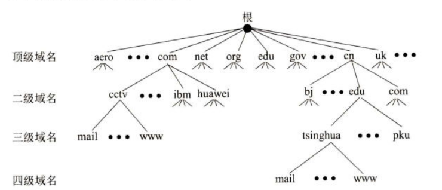

其中根域是空字符串，然后是顶级域名、二级域名...，每一个更低层的域名都是它上一层域名的一个分支。

互联网的名字空间是按照机构的组织来划分的，与物理的网络无关，也和 IP 地址的子网无关。

### 6.1.3 域名服务器

DNS 是一个分布式数据库，旨在存储域名与 IP 地址之间的映射。

实际上，它由遍布世界各地的域名服务器组成。为了避免建立数量庞大的服务器，减少效率，DNS 使用了“区”的概念来进行管理。每个区由一个权威域名服务器管理，并保存该区内所有主机的域名到 IP 地址的映射信息。因此，DNS 的实际管理单位是“区”，它可能与“域”大小相同或更小，但绝不会更大。这种管理方式既保持了 DNS 的分布式特性，又优化了查询速度。

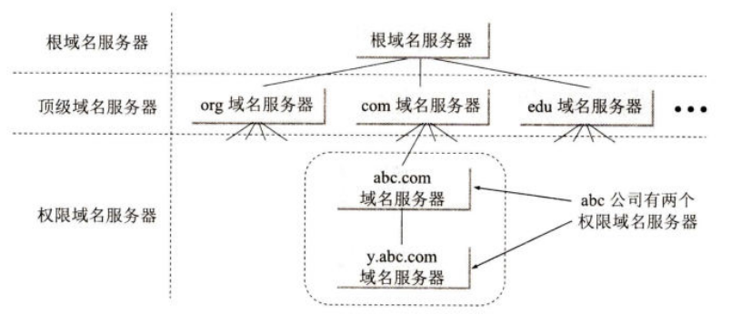

在互联网中，DNS 域名服务器也是按照层次安排的，每一个域名服务器只对域名体系中的一部分进行管辖。根据域名服务器所起的作用，可以把域名服务器划分为四个类别：

- **根域名服务器**：这是最重要的域名服务器。无论是哪一个本地域名服务器，若要解析互联网上的域名，只要自己无法解析，就首先要求助于根域名服务器。

  全球的 DNS 根域名系统设计为只有 13 个根域名（例如 a.root-servers.net 到 m.root-servers.net）。尽管只有 13 个根域名，但实际上并不是只有 13 台物理服务器。这是因为每个根域名实际上由一套服务器系统支持，这套系统可以在多个地点部署多台服务器作为镜像服务器。所有这些服务器都使用相同的域名，只不过它们分布在世界各地。由于根域名服务器采用**任播技术**，因此网络上的路由器能够找到离 DNS 客户最近的一个根域名服务器。这样可以加快查找过程，也能合理利用资源。

  

- **顶级域名服务器**：这些域名服务器负责管理在该顶级域名服务器注册的所有二级域名。

  

- **权限域名服务器**：这些域名服务器负责一个区。当一个权限域名服务器还不能给出最后的答复的时候，就会告诉发出查询请求的 DNS 客户，下一步应该查找哪一个权限域名服务器。

  

- **本地域名服务器**：当一台主机发出 DNS 请求的时候，这个请求最先发给的就是本地域名服务器。它们一般离用户都很近。

为了提高域名服务器的稳定性，DNS 域名服务器都把数据复制到几个域名服务器来保存，其中的一个是**主域名服务器**，其他的是**辅助域名服务器**。

在解析域名的过程中，本机向本地域名服务器的查询一般采用**递归查询**，而本地域名服务器向根域名服务器采用**迭代查询**。

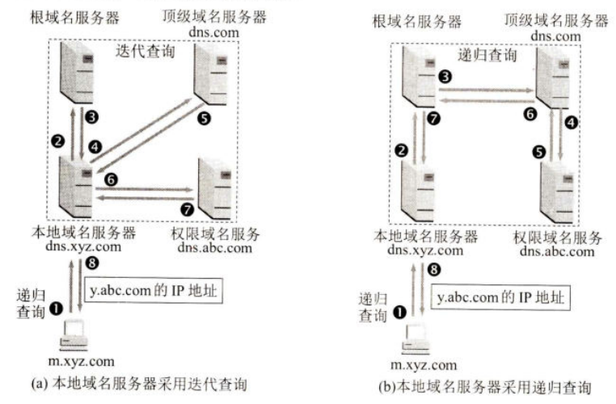

在递归查询中，设备请求本地域名服务器提供最终的解答。如果本地域名服务器没有缓存答案，它将代表设备继续查询直到获取到答案，然后一次性返回给设备。

而在迭代查询中，本地域名服务器向根域名服务器发送请求，如果根服务器没有答案，它不会去查询其他服务器，而是返回一个指向更具体域名服务器的引用。然后本地域名服务器根据这个引用向下一个域名服务器发起新的查询，如此反复，直到找到答案。

为了提高 DNS 查找效率，在域名服务器重广泛采用**高速缓存**。高速缓存用来存放最近查询过的域名，以及从何处获得域名映射信息的记录。

## 6.2 文件传送协议

### 6.2.1 FTP 概述

**文件传送协议 FTP（File Transfer Protocol）**曾是互联网上使用最广泛的文件传送协议。它提供交互式的访问，允许客户指明文件与格式，并允许文件具有存取权限。

FTP 和 TFTP 都是**复制整个文件**的文件共享协议，这类协议若要存取一个文件，就必须先获得一个本地副本，若要修改文件，只能修改文件副本，然后将修改的副本传回。

另一类是**联机访问**。这意味着允许多个程序同时对一个文件进行存取。网络文件系统 NFS 就是一种联机访问协议。

### 6.2.2 FTP 的基本工作原理

文件传送协议 FTP 只提供文件传送的一些基本服务，它使用 TCP 可靠运输服务。FTP 使用客户/服务器模式，一个 FTP 服务器可以为多个客户进程提供服务。FTP 服务器中， **FTP 主进程**负责接收新的请求，**从属进程**负责处理单个请求。

FTP（文件传输协议）的过程可以分为以下几个步骤：

1. **连接建立**：首先，客户端需要与服务器建立一个控制连接。这通常在 FTP 服务器的标准端口（21号端口）上进行。客户端使用用户名和密码登录到服务器。
2. **请求文件或上传文件**：登录成功后，客户端可以请求下载文件（GET 命令）或上传文件到服务器（PUT 命令）。这些操作通过控制连接发送命令来实现。
3. **数据传输**：为了传输文件，FTP 通常会打开一个单独的数据连接。这个连接是由控制连接协商的，可以是主动模式（服务器连接到客户端）或被动模式（客户端连接到服务器）。
4. **传输完成**：文件传输完成后，数据连接会被关闭。客户端可以继续通过控制连接发送更多的传输命令，或者断开连接。
5. **断开连接**：客户端发送一个退出命令（QUIT），然后控制连接被关闭。

然而网络文件系统 NFS 则采用另一种思路。NFS 允许应用进程打开一个远端文件，并可以在该文件的特定位置上开始读写。因此  NFS 在网络上传送的只是少量的修改数据。

### 6.2.3 简单文件传送协议 TFTP

简单文件传送协议 TFTP（Trivial File Transfer  Protocol）使用 UDP 数据报。虽然它也使用客户/服务器模式，但是因为使用 UDP 数据报，因此 TFTP 要有自己的差错改正措施。TFTP 支持文件传输，但是不支持交互。

TFTP 的优点在于，它可以用于 UDP环境，而且代码占用内存小。TFTP 每次传输的报文有 512 字节的数据，按序传送，使用很简单的首部。

TFPT 的工作很像停止等待协议，发送完一个文件块之后等待对方的确认，发完之后再规定时间内收不到确认就重发数据 PDU。发送确认 PDU 的一方若在规定时间内收不到下一个文件块，也要重发确认 PDU。这样就可以保证文件传输的一致。

## 6.3 远程终端协议 TELNET

TELNET 是一个简单的远程终端协议，但是没人用它。

TELNET 也使用客户/服务器模式。它能够适应许多计算机和操作系统的差异。它定义了数据和命令应该怎样通过互联网，这就是**网络虚拟终端 NVT（Network Virtual Terminal）**。

TELNET 的选项协商使得客户和服务器可以商定使用更多的终端功能，协商的双方是平等的。

## 6.4 万维网 WWW

### 6.4.1 万维网概述

**万维网 WWW（World Wide Web）**是一个大规模的、联机式的信息贮藏所。它是建立在互联网上的服务，是互联网提供的众多服务中最显著和广泛使用的一个。万维网提供分布式服务，利用链接的方式是从一个站点访问另一个站点：

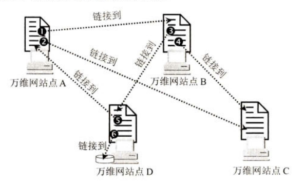

比如上图所示的 ，即使在物理距离上相隔很远，但是连接在万维网上，因此都可以互相访问。

万维网的出现使得计算机操作发生了革命性的变化，只需要点击链接就能访问信息资源。

万维网也以客户/服务器模式工作，浏览器就是用户主机上的客户程序，而万维网文档所驻留的主机则运行服务器程序。**客户程序向服务器程序发出请求，服务器程序向客户程序送回客户所要的万维网文档。**在一个客户程序主窗口上显示出的万维网文档称为**页面（Page）**。

因此，万维网需要解决的问题有：

- 怎样标志分布在整个互联网上的万维网文档：使用**统一资源定位符 URL（Uniform Resource Locator）**来标志万维网上的各种文档，并且每个文档都具有唯一的 URL。
- 用什么样的协议来实现万维网上的各种链接：使用应用层协议**超文本传输协议 HTTP（HyperText Transfer Protocol）**。HTTP 利用 TCP 实现可靠传输。
- 怎样使不同风格的万维网文档都能在各种主机上显示：使用**超文本标记语言 HTML（HyperText Markup Language）。**
- 怎样使用户能够方便的找到所需的信息：使用搜索工具。

### 6.4.2 统一资源定位符 URL

统一资源定位符 URL 是用来表示从互联网上得到的资源位置和访问这些位置的方法。URL 相当于一个文件名在网络范围的扩展，因此 URL 是与互联网相连的机器上的任何可访问对象的一个指针。由于访问不同对象所使用的协议不同，所以 URL 还指出读取某个对象所使用的协议。它的一般形式由下面四个部分组成：
$$
\text{协议://主机名:端口/路径}
$$
协议指出用何种协议来获取文档，比如 HTTP，或者 FTP 等。主机名是存放万维网文档的主机域名，但是也可以直接用 IP 地址表示。端口通常是省略的。而最后的路径可能是较长的字符串，但是有时也不需要使用。

使用 HTTP 的 URL 最常用的形式是把端口省略掉，变成下面的形式：
$$
\text{http://主机名/路径}
$$
若再将 URL 重的路径省略，那么 URL 就指明互联网上的某个**主页（Home Page）**。它通常是一个网站的起始页面。

需要注意的是，尽管协议和主机名不区分大小写，但是**路径区分字母的大小写**。

### 6.4.3 超文本传输协议 HTTP

1. HTTP 操作过程

HTTP 定义了浏览器怎样向万维网服务器请求万维网文档，以及浏览器怎样把文档传送给浏览器。HTTP 是**面向事务的应用层协议**。下面这张图展示了万维网大致的工作过程。

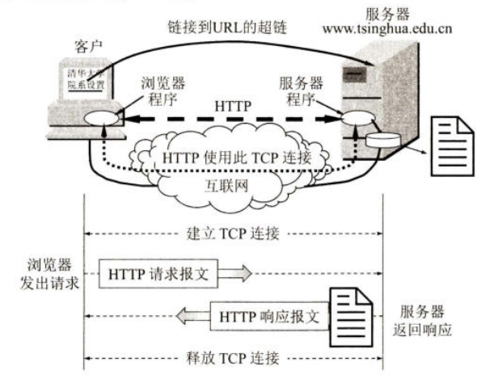

每个万维网服务器监听 TCP 端口 80，等待浏览器的连接请求。一旦建立连接，浏览器就向服务器发送页面请求，服务器随后返回请求的页面。这个交互过程遵循 HTTP 协议的规定格式和规则。HTTP 交互包括由 ASCII 字符串组成的请求和“类MIME”的响应，通常通过 TCP 连接传送。完成交互后，TCP 连接被释放。

HTTP 使用了面向连接的 TCP 作为运输层协议，但是 **HTTP 本身是无连接的**，这就是说，虽然 HTTP 使用了 TCP 连接，但是通信的双方在交换 HTTP 报文之前不需要先建立  HTTP 连接。此外，**HTTP 是无状态的**。也就是说，服务器不会记住访问过的客户。（使用 Cookie 可以解决这个问题，下面介绍完）

当用户点击链接请求文档时，HTTP 协议会先与服务器建立 TCP 连接，这涉及到三报文握手。在三报文握手的前两个报文完成后（大约一个往返时延 RTT），万维网客户端（浏览器）将 HTTP 请求报文作为三报文握手的第三个报文的数据发送给服务器。服务器接收到 HTTP 请求后，便返回所请求的文档作为响应报文。

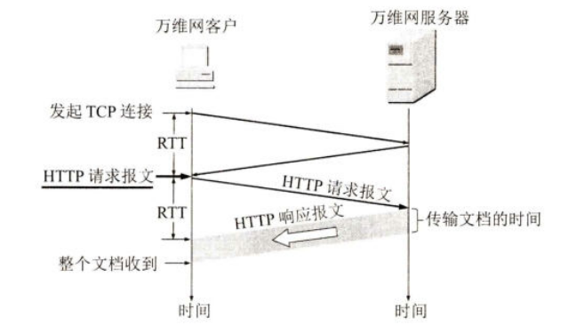

也就是说，请求一个万维网文档所需的时间是：该文档的传输时间 + RTT*2 。

对 HTTP/1.0 来说，每请求一个文档就要有两倍 RTT 开销，因此在传输很多对象的时候，效率很低。

而 HTTP/1.1 采用了**持续连接**，它在发送响应之后一段时间内仍然保持连接，使得可以传送后续的 HTTP 请求报文和响应报文。HTTP/1.1 的持续链接也有两种方式：非流水线方式、流水线方式。非流水线方式只有在客户收到前一个请求的响应之后，才能发出下一个请求；而流水线方式则可以在客户收到 HTTP 响应报文之前，就能发送新的请求报文。

后来的 HTTP/2.0 对 HTTP/1.1 进行了升级，它允许服务器发回的响应变成**并行发回**，从而缩短服务器响应时间；也允许**复用 TCP** 进行多个请求。此外，它还通过划分报文为多个二进制编码的帧，并且不重复发送相同的首部字段，来提高传输效率。

2. 代理服务器

在万维网中，还会采用一种叫做**代理服务器**的网络实体。它又被称作**万维网高速缓存**。代理服务器会把最近的请求、响应暂存在本地磁盘中。当新的请求到达时，代理服务器中如果存在缓存，就可以直接返回缓存内容。这样就能节省时间。

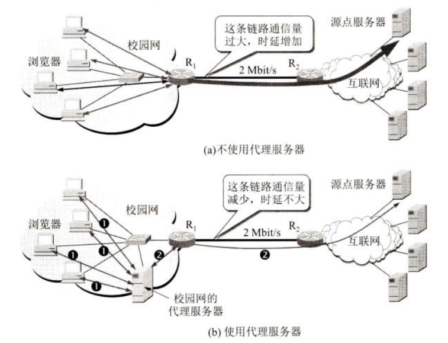

以代理服务器方式构成的**内容分发网络 CDN（Content Distribution Network）**在互联网应用中起到了很大作用。

3. HTTP 报文结构

HTTP 有两种报文：请求报文，响应报文。

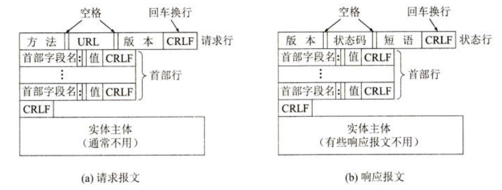

由于 HTTP 是**面向文本的**，因此报文中的字段长度是不确定的。HTTP 请求报文和响应报文都是由三个部分组成的，区别就是开始行的不同。

- 开始行：用于区分报文是请求报文还是响应报文。
- 首部行：用于说明一些信息。
- 实体主体：一般不会使用这个字段。

HTTP 请求报文的第一行是请求行，请求行只有三个内容：**方法、请求资源的 URL、HTTP 版本**。这里的**方法**其实就是一些命令，比如 GET、POST、PUT 之类的，比如下面的例子：
$$
\text{GET http://www.xyz.edu.cn/dir/index.htm HTTP/1.1}
$$
而下面的是一个完整的 HTTP 请求报文的例子：
$$
\begin{array}{l}
\text{GET /dir/index.htm HTTP/1.1} & \text{\{请求行使用了相对 URL\} } \\
\text{Host: www.xyz.edu.cn} & { \{此行是首部行的开始。这行给出主机的域名\} }\\
\text{Connection: close} & { \{告诉服务器发送完请求的文档后就可释放连接\} } \\
\text{User-Agent: Mozilla/5.0} & { \{表明用户代理是使用火狐浏览器 Firefox\} } \\
\text{Accept-Language: cn} & { \{表示用户希望优先得到中文版本的文档\} } \\
&{\{请求报文的最后还有一个空行\} }
\end{array}
$$

而 HTTP 响应报文的第一行是状态行，它也只有三个内容：**HTTP 版本、状态码、解释状态码的短语**。这里的**状态码**都是三位数字，分为 5 大类：

- **1xx (信息性状态码)**：表示接收到请求，正在处理。它们是临时响应，表明客户端应继续请求或忽略这些响应。
- **2xx (成功状态码)**：表示请求已成功被服务器接收、理解，并接受。例如，200 OK 是最常见的成功状态码。
- **3xx (重定向状态码)**：表示为了完成请求，需要进一步操作。通常这意味着客户端需要执行额外的动作，如重定向到另一个 URL。
- **4xx (客户端错误状态码)**：表示请求存在语法错误或无法被执行。常见的如 404 Not Found，意味着服务器找不到请求的资源。
- **5xx (服务器错误状态码)**：表示服务器在处理请求时内部发生错误。例如，500 Internal Server Error 表示服务器遇到了意外情况，无法完成请求。

比如下面所示的：
$$
\begin{array}{l}
\text{HTTP/1.1 202 Accepted} & \text{\{接受\}} \\
\text{HTTP/1.1 400 Bad Request} & \text{\{错误的请求\}} \\
\text{Http/1.1 404 Not Found} & \text{\{找不到\}} \\
\end{array}
$$

4. Cookie

前面已经说过了，HTTP 是无状态的，这也就意味着服务器记不得用户。但是实际上一些网站希望能记得用户。因此在 HTTP 中需要使用 Cookie 来做到这点。

Cookie 的工作原理如下：

- 当用户访问使用 Cookie 的网站时，服务器会为用户创建一个唯一的识别码，并在其数据库中存储相关信息。
- 服务器通过 HTTP 响应向用户的浏览器发送一个 `Set-cookie` 首部行，包含这个识别码。
- 用户的浏览器收到响应后，会在特定的 Cookie 文件中保存这个识别码和服务器的主机名。
- 当用户继续浏览该网站时，浏览器会在每个 HTTP 请求中包含一个 `Cookie` 首部行，携带之前保存的识别码。
- 服务器通过识别码跟踪用户的活动，如访问历史、购物车内容等。
- 如果用户在之后再次访问网站，浏览器会继续在请求中发送相同的 Cookie，允许网站识别用户并提供个性化服务。

### 6.4.4 WWW 的文档

1. 超文本标记语言 HTML

如果要让所有计算机都能显示出一个万维网服务器上的页面，那么就要解决页面的标准化问题。**超文本标记语言 HTML（HyperText Markup Language）**就是一种制作万维网页面的标准语言。

HTML 定义了许多用于排版的命令，也即“**标签（tag）**“。它将标签嵌入到万维网的页面中，从而构成 HTML 文档。

此外还有：

- **可扩展标记语言 XML 。**这是一种主要用于传输和存储数据的标准化语言。
- **可扩展超文本标记语言 XHTML 。**这是 HTML 的一个更严格的版本。
- **层叠样式表 CSS 。**用于描述网页的布局和表现的语言。CSS 使开发者能够控制网页的字体、颜色、布局等样式。

2. 动态万维网文档

上面所说的都属于**静态文档**。静态文档在被用户浏览的过程中，内容都不会改变。而**动态文档**是指文档的内容是在浏览器访问万维网时由应用程序创建的。

这里增加了一个名为**通用网关接口 CGI（Common Gateway Interface）**的机制，用于生成动态内容的网页服务器和应用程序之间的接口。

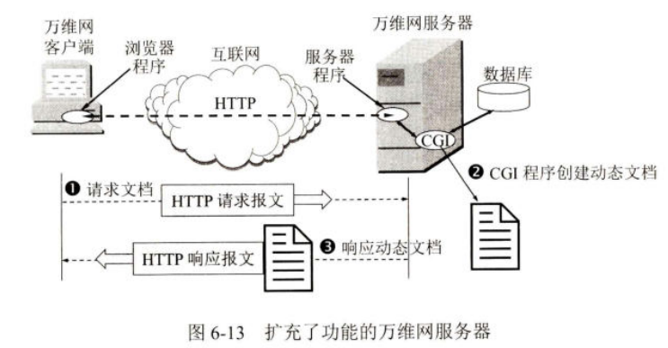

3. 活动万维网文档

随着发展，动态文档已经明显的不能满足需求。这是因为动态文档一旦建立，所包含的内容也就固定下来了，而动画之类的效果，动态文档也无法提供。因此有两种新技术：服务器推送、活动文档。

**服务器推送**可以连续更新浏览器屏幕，但是开销很大，因此常用的是**活动文档**。活动文档将工作转移给浏览器，用户在本地运行。

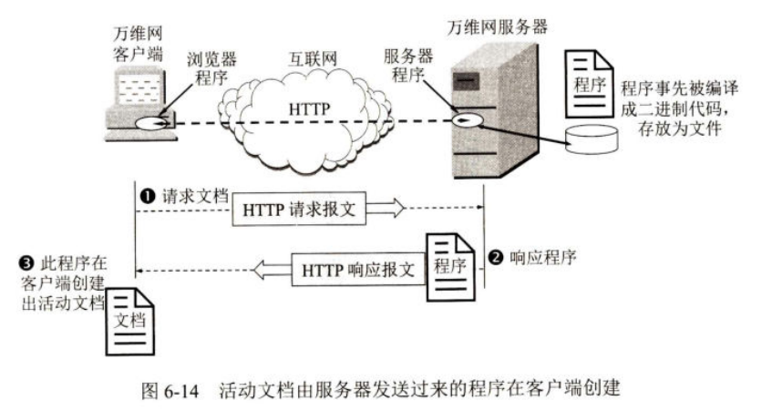

### 6.4.5 万维网的信息检索系统

1. 全文检索搜索与分类目录搜索

我们知道，互联网是一个大型的信息储藏所。那么，如何查找信息呢？答案是利用搜索引擎。搜索引擎大体上可以分为两类：**全文检索搜索引擎**、**分类目录搜索引擎**。

1. **全文搜索引擎**：通过自动抓取网页内容，然后使用算法对整个网页的文本进行索引。用户查询时，搜索引擎根据索引查找包含查询关键词的网页。这种搜索引擎（如 Google、Bing）能处理大量的数据，并能基于关键词的相关性返回结果。
2. **分类目录搜索引擎**：依靠人工将网站和网页按主题或类别进行分类和组织。用户搜索时，是在这些预定义的类别中进行检索。这种搜索引擎（如 Yahoo! Directory，已停止服务）更侧重于结构化和有组织的信息浏览，但不如全文搜索引擎那样灵活和全面。

2. Google 搜索引擎

Google 的搜索引擎优势在于使用先进的硬件和软件，特别是其核心技术 PageRank™，由创始人 Larry Page 和 Sergey Brin 开发。PageRank 通过分析互联网上的链接结构来确定页面的重要性，给予指向重要网页的链接更高的权重。Google 还进行超文本匹配分析，确保搜索结果与查询相关。与传统依赖关键字频率的搜索引擎不同，Google 的方法侧重于页面的整体重要性和与搜索查询的相关性。尽管 Google 的方法有效，但用户仍需谨慎对待搜索结果中的广告信息。

### 6.4.6 博客、微博

近年来，博客和微博也广为流行。

### 6.4.7 社交网站 SNS

社交网站 SNS 是近年来发展非常迅速的一种网站，它让一群有着相同兴趣的人创建在线社区。

## 6.5 电子邮件

### 6.5.1 电子邮件概述

**电子邮件 E-Mail** 将邮件发送到收件人使用的邮件服务器，并放在收件人邮箱中。电子邮件最重要的两个草案标准，是**简单邮件传送协议 SMTP（Simple Mail Transfer Protocol）**和**互联网文本报文格式**。

由于互联网的 SMTP 只能传送 7 位 ASCII 码邮件，因此后来又更新了**通用互联网邮件扩充 MIME（Multipurpose Internet Mail Extensions）**。MIME 邮件中可同时传送多种类型的数据。

一个电子邮件系统应具有三个主要组成构件：**用户代理、邮件服务器、邮件发送（如 SMTP）和读取协议（如 POP3）**。

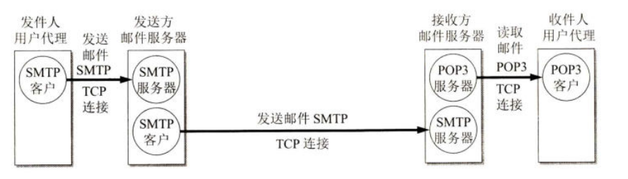

**用户代理 UA（User Agent）**是用户与电子邮件系统的接口，大多数情况下是运行在用户计算机中的一个程序，因此用户代理又称作为**电子邮件客户端软件**。用户代理至少应该具有以下四种功能：

- 撰写：给用户提供编辑信件的环境。
- 显示：能在屏幕上显示来信内容。
- 处理：能够发送、接收邮件，并且对来信进行处理。
- 通信：能利用协议收发信件。

目前的互联网上有许多**邮件服务器**可供用户选择。邮件服务器也是运行在客户/服务器模式下的。这些服务器不间断工作，能够接收和发送大量的信件，并且向发件人报告邮件传送的结果。通常邮件服务器需要使用**两种协议**，一种用于 UA 向邮件服务器发送邮件或是在邮件服务器之间发送邮件，比如 SMTP；另一种则是用于 UA 向邮件服务器读取邮件，比如 POP3 。无论是 SMTP、POP3 还是 IMAP，都是使用 TCP 连接来传送邮件的。

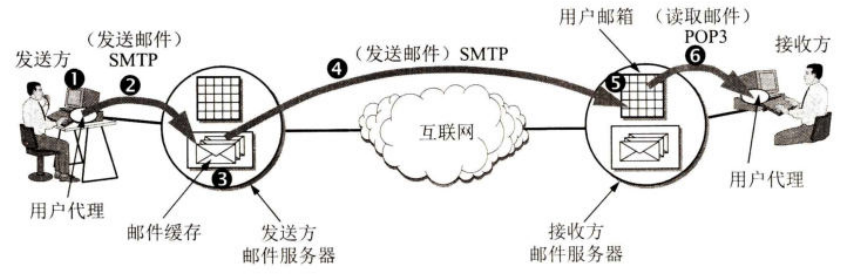

发送电子邮件的过程包括以下几个步骤：

1. 发件人使用用户代理（如邮件客户端）撰写并编辑邮件。
2. 发件人点击发送，用户代理通过 SMTP 协议将邮件发送到发件人的邮件服务器，这个过程对用户是不可见的。
3. SMTP 服务器接收邮件后，暂时存储在邮件缓存队列中，等待发送到收件人的邮件服务器。
4. 发件人的邮件服务器与收件人的邮件服务器建立 TCP 连接，并发送邮件。如果无法建立连接或发送失败，邮件会保留在发件服务器并稍后重试。
5. 收件人的邮件服务器接收邮件后，将邮件存入收件人的邮箱。
6. 收件人使用用户代理通过 POP3 或 IMAP 协议读取邮件。通信由 POP3 客户端发起，邮件从服务器传送到客户端。

电子邮件由**信封**和**内容**组成，传输程序根据信封上的邮件来传送邮件。在信封上，最重要的是收件人的地址。TCP/IP 体系的电子邮件系统规定 **电子邮件地址 E-mail Address** 的格式如下：
$$
\text{用户名@邮件服务器域名}
$$
比如 $\text{xyz@abc.com}$ ，其中 $\text{xyz}$ 就是**用户名**，也就是**收件人邮箱名**，这在每个邮件服务器中必须是唯一的；而 $\text{abc.com}$ 就是服务器的域名。

### 6.5.2 简单邮件传送协议 SMTP

SMTP 规定了两个相互连通的 SMTP 进程之间如何交换信息。

1. 连接建立

SMTP 连接建立的过程如下：

- 发送方邮件服务器的 SMTP 客户端定期（如每 30 分钟）检查邮件缓存，检查是否有新邮件需要发送。
- 发现新邮件后，SMTP 客户端使用 SMTP 的熟知端口号 25 与接收方的 SMTP 服务器建立 TCP 连接。
- 连接建立后，接收方 SMTP 服务器发送“220 Service ready”消息表示服务就绪。
- SMTP 客户端发送 HELO 命令和发送方的主机名给 SMTP 服务器。
- SMTP 服务器回应“250 OK”表示准备好接收邮件，或者“421 Service not available”表示服务不可用。
- 若邮件在限定时间内（如三天）未能发送成功，邮件服务器会通知发件人。
- SMTP 直接在发送方和接收方邮件服务器之间建立 TCP 连接，不使用中间邮件服务器，即使过程中经过多个路由器。

2. 邮件传送

SMTP 传输邮件的过程包括以下步骤：

1. 传送开始于 MAIL 命令，后面附带发件人地址。若 SMTP 服务器准备好接收，则回复“250 OK”，否则返回错误代码。
2. 接着是一个或多个 RCPT 命令，指定一个或多个收件人地址。服务器对每个 RCPT 命令回复确认或错误消息。
3. 然后是 DATA 命令。这标志着邮件内容的开始。服务器回复“354 Start mail input; end with <CRLF>.<CRLF>”。如果不能接收，则返回 421（服务器不可用）、500（命令无法识别）之类的。然后 SMTP 客户端发送邮件内容，结束后用“<CRLF>.<CRLF>”表示结束。服务器确认收到后回复“250 OK”，或返回差错代码。
4. 邮件送达后，接收方可能因多种原因未能即时阅读，如邮箱故障、未检查邮箱、容量用尽或邮件被误判为垃圾邮件等。

3. 连接释放

SMTP 连接释放的过程如下：

1. 邮件发送完毕后，SMTP 客户端发送 QUIT 命令。
2. SMTP 服务器响应“221 (服务关闭)”，同意释放 TCP 连接，至此邮件传送过程结束。
3. 用户通常不会看到这些过程，因为它们被电子邮件客户端软件屏蔽。

关于 SMTP 的缺点和升级：
- SMTP 允许任意填写发件人地址，这使得垃圾邮件发送变得容易。
- SMTP 本来只用于传送 ASCII 码，后来虽通过 MIME 支持了二进制数据传输，但效率不高。
- SMTP 使用明文传输，存在安全隐患。
- 为解决这些问题，SMTP 被扩充为 ESMTP（Extended SMTP），引入了客户端验证、二进制数据支持、安全传输等新功能。

### 6.5.3 电子邮件的信息格式

我们知道，电子邮件被分为信封和内容两大部分。首部的格式是确定的，而主体部分则是用户自己填写。邮件内容首部包括一些关键字，后面加上冒号。最重要的关键字是：To、Subject。

- “To：”，后面填入一个或者多个收件人的电子邮件地址。
- “Subject：”，是邮件的**主题**。
- “Cc：”，是**抄送（Carbon Copy）**的意思，意思是留下**复写副本**，表示给某人发送一个**邮件副本**。
- “Bcc：”，是**盲复写副本（Blind Carbon Copy）**，允许发送者将邮件同时发送给多个收件人，而这些收件人的邮箱地址对彼此是不可见的。
- “From：”，表示发件人电子邮件地址。
- “Date：”，表示发信日期。
- “Reply-to：”，回信所用的地址。

### 6.5.4 邮件读取协议 POP3 和 IMAP

目前常用的邮件读取协议有：邮局协议第三个版本 POP3，以及**网际报文存取协议 IMAP（International Message Access Protocol）**。

POP3（邮局协议第三版）是一个简单且功能有限的邮件读取协议，首次发布于 1984 年，并在 1996 年更新为现在广泛使用的版本。它遵循客户端-服务器模型，其中用户的电子邮件客户端（POP3 客户端）与邮件服务器（运行 POP3 服务器程序）进行交互以接收邮件。邮件服务器还必须运行 SMTP 服务器程序以接收发件方的邮件。POP3 的一大特点是一旦用户从服务器读取邮件，邮件就会被删除，尽管现在有扩展功能允许用户设置在服务器上保留邮件的时间。

另一个读取邮件的协议是网际报文存取协议 IMAP，它比 POP3 复杂得多。

在使用 IMAP 时，在用户的计算机上会运行 IMAP 客户程序，然后与接收方的邮件服务器上的 IMAP 服务器程序建立 TCP 连接。用户在自己的计算机上就可以操纵邮件服务器的邮件，就像在本地操纵一样，因此 IMAP 是联机协议。当用户计算机上的 IMAP 客户程序打开 IMAP 服务器的邮件时，用户就可以看到邮件的首部。若用户需要打开某个邮件的时候，邮件才会传送到用户的计算机上。在用户未发出删除邮件的命令之前，IMAP 服务器邮箱中的邮件一直会保存着。

IMAP 最大的好处是用户可以在不同的地方，使用不同的设备，随时上网阅读和处理自己在邮件服务器中的邮件。但是 IMAP 的缺点也是如此产生的，如果用户没有下载自己的邮件，那么必须要联网才行。

### 6.5.5 基于万维网的电子邮件

Webmail（基于万维网的电子邮件）允许用户通过互联网浏览器而不是传统的用户代理软件来收发邮件，从而提供了更大的便利性和可访问性。用户可以在任何设备上通过浏览器访问自己的电子邮件，所有邮件数据（包括已发送和已删除的邮件以及通讯录）都保存在云端，无需在本地计算机安装特定软件。在用户浏览器和邮件服务器之间传输邮件时使用 HTTP 协议，而服务器之间的邮件传输仍然使用 SMTP 协议。

常见的 Webmail 服务包括 Gmail、Hotmail、Yahoo 邮箱以及网易、新浪和腾讯的邮箱服务。

### 6.5.6 通用互联网邮件扩充 MIME

我们知道 SMTP 有内容限制的缺点，因此在这种情况下就提出了**通用互联网邮件扩充 MIME**。它的意图是扩充 SMTP 邮件主体的内容，可以在现有的电子邮件程序和协议下传送。

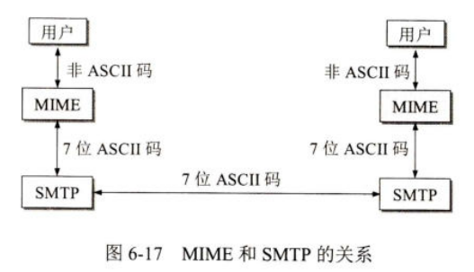

MIME 新增了五个新的邮件首部字段，分别是：

- MIME-Version：MIME 的版本。
- Content-Description：说明此邮件主体是否是图像、音频或者视频。
- Content-Id：邮件的唯一标识符。
- Content-Transfer-Encoding：在传送时邮件时如何编码的。
- Content-Type：说明邮件主体的数据类型和子类型。

下面对最后两项内容进行展开介绍。

内容传送编码：

最简单的编码就是 7 位的 ASCII 编码，而每行不能超过 1000 个字符。MIME 对这种由 ASCII 码构成的邮件主体不进行任何转化。

另一种编码是 quoted-printable，这种编码方式适用于所传送的数据中只有非常少量的非 ASCII 码，比如汉字。它旨在使邮件中的非 ASCII 字符或特殊字符能够通过仅支持 7 位 ASCII 的传输媒介安全传输。在 quoted-printable 编码中，这些字符被编码为等号（"="）后跟两个十六进制数字，表示字符的 ASCII 值。例如，"=" 字符自身会被编码为 "=3D"。

对于任意的二进制文件，可以使用 base64 编码，比如下图所示的：

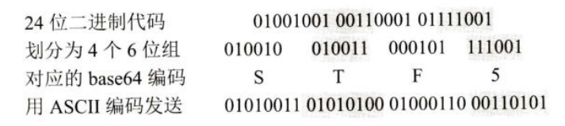

Base64 编码通过将每三个字节的二进制数据（共 24 位）分为四个 6 位的组，然后将这些 6 位组映射到特定的 64 个 ASCII 字符集（包括大写字母、小写字母、数字和两个特殊字符）上。如果原始数据的字节数不是 3 的倍数，Base64 编码会使用特殊的填充字符（通常是“=”)来补足。这种编码方式可以确保二进制数据在文本形式的网络协议中安全传输。

内容类型：

MIME 标准给定 Content-Type 说明中必须含有两个标识符，即内容类型（type）和子类型（subtype），用“/”分开。

尽管 MIME 到现在还是草案标准，但是为了避免产生冲突，标准定义了大量的类型。此外还允许用户自己定义专用的内容类型，但是需要以字符串”X-“开头。

此外，MIME 中的 multipleart 定义了四种可能的子类型：mixed、alternative、parallel 和 digest，分别用于不同的场景。

1. **mixed**：用于包含多个独立子报文，每个子报文可以有不同的类型和编码。这使得一个邮件能够包含文本、图像、声音等多种类型的内容，类似于含有多个附件的商业信件。

2. **alternative**：允许一个邮件包含同一内容的多种表现形式。例如，可以同时用普通文本和富文本格式发送同一邮件，让接收者根据自己的设备选择最合适的格式查看。

3. **parallel**：用于包含多个可以同时展示的子部分。例如，一个邮件可能包含需同时播放的图像和声音部分。

4. **digest**：允许一个邮件包含一系列其他邮件，常用于电子邮件列表或讨论组，将多个邮件合并为一个邮件发送。

## 6.6 动态主机配置协议 DHCP

为了把协议软件做成通用的和便于移植的，协议软件的编写者不会把所有的细节都固定在源代码中。相反，他们把协议软件参数化。这就使得很多计算机上的软件都是一样的，而区别则是通过参数来体现。

我们知道，一个协议软件在使用之前必须要正确配置才行。在协议软件中，给这些参数赋值的动作称为**协议配置**。早期的协议配置是人工进行的，但是现在已经广泛采用自动协议配置的方法，也即**动态主机配置协议 DHCP（Dynamic Host Configuration Protocol）**。它提供了一种称为即插即用联网的机制，允许一台计算机加入新的网络、获取 IP 地址，且不用手工参与。

DHCP 位网络设备分配 IP 地址的步骤如下：

1. 当需要 IP 地址的主机启动时，它作为 DHCP 客户端，向网络广播发送发现报文（DHCPDISCOVER），以发现 DHCP 服务器的位置。此时，主机还没有分配到自己的 IP 地址，因此源 IP 地址设置为 0.0.0.0，目的 IP 地址设置为广播地址 255.255.255.255。
2. 网络上的所有设备都能接收到这个广播报文，但只有 DHCP 服务器会对其进行回应。
3. DHCP 服务器在收到发现报文后，会检查其数据库中是否有该计算机的配置信息。如果有，则返回该信息；如果没有，则从服务器的 IP 地址池中分配一个地址，并通过提供报文（DHCPOFFER）将此 IP 地址和其他网络配置信息提供给客户端。

但是为了避免出现太多 DHCP 服务器，因此不是每个网络都会设置 DHCP 服务器。现在是每个网络至少有一个 **DHCP 中继代理**（通常是一台路由器），它配置了 DHCP 服务器的 IP 地址。

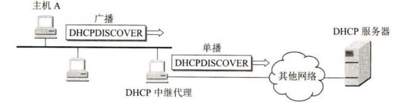

当代理收到主机 A 以**广播**形式发送的发现报文之后，就以**单播**方式向 DHCP 服务器转发此报文，并等待回答。收到 DHCP 服务器回答的报文后，DHCP 中继代理再将此报文发回主机 A 。

DHCP 分配给客户的 IP 地址是临时的，称之为**租用期**。租用期是由 DHCP 服务器自己决定的。DHCP 的工作过程通常包括以下四个主要步骤：

1. **发现（Discovery）**：客户端启动时发送一个 DHCP 发现报文（DHCPDISCOVER），寻找可用的 DHCP 服务器。
2. **提供（Offer）**：DHCP 服务器收到发现报文后，回应一个 DHCP 提供报文（DHCPOFFER），向客户端提供 IP 地址及其他配置信息。
3. **请求（Request）**：客户端选择一个 DHCP 服务器的提供报文，并通过发送 DHCP 请求报文（DHCPREQUEST）来请求这些网络配置。
4. **确认（Acknowledgment）**：DHCP 服务器接收到请求报文后，发送一个 DHCP 确认报文（DHCPACK）给客户端，确认 IP 地址分配及其他配置信息。

## 6.7 简单网络管理协议 SNMP

### 6.7.1 网络管理的基本概念

**网络管理包括对硬件、软件和人力的使用、综合和协调，一边对网络资源进行监视、测试、配置、分析、评价和控制，这样就能以合理的价格满足网络的一些需求，比如实时运行性能、服务质量等。网络管理通常称为网管。**

网络管理模型中的主要构件如下所示：

**管理站**，是整个网管系统的核心。管理站所在的部门通常称为**网络运行中心 NOC（Network Operations Center）**。

管理站中的关键构建是**管理程序**。管理程序在运行时就成为**管理进程**。管理站或者管理程序都可以称为**管理者**或者**管理器**。

在被管网络中，有许多**被管设备**，而每个被管设备都可能有许多**被管对象**。但是在被管设备中也有**不能被管的对象**。在被管设备中需要运行**网络管理代理程序**（简称为**代理**）来和管理站中的管理程序保持通信。

此外还需要**网络管理协议**，简称**网管协议**。比如**简单网络管理协议 SNMP（Simple Network Management Protocol）**，它的管理程序和代理程序按客户/服务器模式工作。但是不一样的是，管理程序运行 **SNMP 客户程序**，而代理程序运行 **SNMP 服务器程序**。这是因为管理程序需要主动的发送请求，而代理程序则是响应请求。

SNMP 遵从“若要管理某个对象，则必然会给该对象加一些硬件或者软件。但这种”添加“需要对原对象的影响尽量小。”的原则，它最重要的指导思想就是**尽可能简单**。（尽管发展到现在也已经相当庞大）

下面给出 SNMP 的一些基本概念：

1. **SNMP的局限性**：如果一个网络元素不使用SNMP协议，而是使用其他网络管理协议，那么SNMP无法直接管理这个元素。在这种情况下，可以使用代理（委托代理）来进行协议转换和过滤操作，从而实现对该元素的管理。
2. **SNMP的三个组成部分**：
   - **SNMP本身**：定义了管理站和代理之间交换的分组格式。这些分组包含各代理中的对象（变量）名称及其状态（值）。SNMP负责读取和修改这些值。SNMP 类似于程序中的语句，用于存储、更改和解释MIB中声明的对象值。
   - **SMI（管理信息结构）**：定义了命名对象和定义对象类型的通用规则（包括范围和长度），以及如何对对象及其值进行编码。这样做的目的是确保网络管理数据的语法和语义清晰、无歧义。SMI不定义被管理对象的数量、对象名或对象名与其值之间的关联。SMI 类似于程序设计中的语言规则，如变量命名和数据类型定义。
   - **MIB（管理信息库）**：在被管理的实体中创建命名对象，并规定了其类型。MIB 相当于程序设计中对变量的声明，例如定义变量类型和命名。

### 6.7.2 管理信息结构 SMI

根据上面所说的，SMI 应当有三个功能。

1. 被管对象的命名

SMI 规定，所有被管对象都必须处在**对象命名树**上。

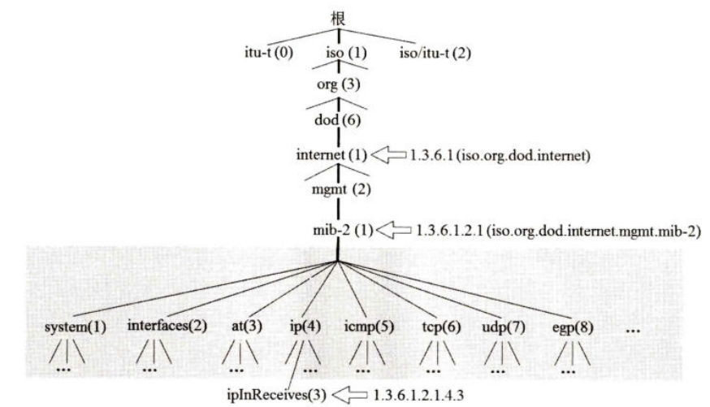

2. 被管对象的数据类型

SMI 使用基本的**抽象语法记法 1**来定义数据类型，他将数据类型分为两大类：简单类型和结构化类型。

3. 编码方法

SMI 使用 ASN.1 制定的**基本编码规则 BER**。它将所有数据类型定义为 TLV 三个字段组成的序列：

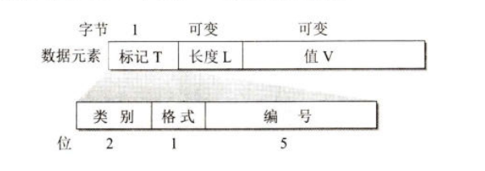

1. **标签（Tag）**：标签是一个标识符，用于指示数据项的类型或用途。
2. **长度（Length）**：长度字段指示随后的值字段中数据的长度。
3. **值（Value）**：值字段包含实际的数据。

### 6.7.3 管理信息库 MIB

所谓“**管理信息**”就是指在互联网的网管框架中**被管理对象的集合**。被管对象必须维持可供管理程序读写的若干控制和状态信息。而这些被管对象构成了一个虚拟的信息存储器，所以才称为**管理信息库 MIB**。管理程序利用这些信息的值对网络进行管理。

MIB包含了网络设备（如路由器、交换机、服务器等）的各种信息，例如设备的性能、状态和配置数据。通过MIB，管理员可以收集、管理和监控网络设备和服务的信息，以确保网络的有效运行。MIB的结构是分层次的，包含了一系列的对象，每个对象都有一个唯一的标识符。这些信息对于网络管理是非常重要的。

### 6.7.4 SNMP 的协议数据单元和报文

实际上，SNMP 的操作只有两种基本的管理功能：读和写。这两个操作都是通过探询操作来实现的，也就是 SNMP 管理进程定时向被管理设备周期性的发送探询信息。但是 SNMP 又不是完全意义上的探询协议，因为它允许不仅过询问就能发送被称为“**陷阱**”的信息。

而正是因为使用了探询（至少是周期性的）以维持对网络资源的实时监视，同时采用了陷阱机制报告特殊事件，使得 SNMP 成为一种有效的网络管理协议。

SNMP 使用无连接的 UDP，因此传送报文的开销较小，但是 UDP 不保证可靠交付。由于 SNMP 使用 ASN.1 报文进行编码，因此在人工编码和理解的时候都很困难。下面给出的是 SNMP 报文的格式：

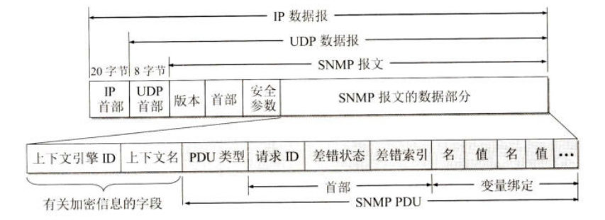

在这中，与网络管理直接相关的是 SNMP PDU 部分。其中，PDU 类型、请求  ID、差错状态、差错索引以及变量绑定的格式都是一样的。而请求 ID 是由管理进程设置的 4 字节整数值、差错状态是用来表示状态的初始为 0 的值、差错索引是一个用来指明有差错的变量在变量列表中的偏移的初始为 0 的变量、变量绑定用来指明一个或多个变量的名和对应的值。

## 6.8 应用进程跨越网络的通信

我们已经讨论过了几种常见的互联网应用层协议，但是有的应用在需要互联网支持的同时，又不能直接使用标准化的互联网应用协议。这个时候就需要**系统调用**和**应用编程接口**。

### 6.8.1 系统调用和应用编程接口

大多数操作系统使用**系统调用**的机制，在应用程序和操作系统之间传递控制权。系统调用和函数调用非常相似。

**系统调用和API**：

当应用进程需要操作系统提供服务时，会通过系统调用接口将控制权传递给操作系统。这个接口允许操作系统执行请求的操作，完成后再将控制权返回给应用进程。系统调用接口也被称为API，它从程序设计角度定义了标准的系统调用函数，使应用程序可以利用这些标准函数获得操作系统的服务。

**TCP/IP 协议软件**：

TCP/IP 协议已被整合到操作系统中，被设计为能在多种操作系统环境下运行。TCP/IP标准没有规定应用程序与TCP/IP协议软件之间的接口细节，而是留给系统设计者选择API的具体实现细节。

**套接字接口（Socket Interface）**：

套接字接口是一种著名的API，用于Berkeley UNIX操作系统，也被微软公司在Windows操作系统中以“Windows Socket”（WinSock）的形式采用。AT&T的UNIX系统V使用的是TLI（Transport Layer Interface）API。

**套接字作为应用进程和运输层协议之间的接口**：

套接字被视为应用进程和TCP或UDP等运输层协议之间的接口。套接字现在是计算机操作系统内核的一部分。在套接字以上的进程由应用程序控制，而套接字以下的运输层协议由操作系统控制。

**套接字的使用和系统资源的分配**：

当应用进程需要使用网络通信时，它首先发出socket系统调用，请求操作系统为其创建一个套接字。套接字描述符是操作系统为网络通信所需的资源分配的代表，应用进程使用这个描述符进行各种网络操作。通信结束后，通过close系统调用来通知操作系统回收资源。

**套接字数据结构和参数设置**：

每个套接字描述符都指向一个套接字数据结构，该结构包含多个参数，如协议族和服务类型。新创建的套接字的某些项目（如IP地址和端口号）初始时是未设置的。

### 6.8.2 几种常见的系统调用

**建立连接阶段**

1. **socket()**：
   - 用途：创建一个新的套接字。
   - 描述：这是开始TCP通信的第一步，用于分配必要的资源和定义套接字的类型（如TCP）。

2. **bind()**（可选，通常用于服务器端）：
   - 用途：将套接字绑定到一个本地地址和端口上。
   - 描述：这通常在服务器端进行，以便客户端知道连接到哪个地址和端口。

3. **listen()**（服务器端）：
   - 用途：让套接字进入监听状态，准备接受连接请求。
   - 描述：这标志着服务器准备好接受来自客户端的连接请求。

4. **connect()**（客户端）：
   - 用途：客户端发起到服务器的连接请求。
   - 描述：客户端通过这个调用指定服务器的地址和端口，发起连接。

5. **accept()**（服务器端）：
   - 用途：接受客户端的连接请求。
   - 描述：服务器通过此调用接受客户端的连接。这个调用通常会阻塞，直到有客户端连接。

**数据传输阶段**

1. **send() / write()**：
   - 用途：向连接的另一端发送数据。
   - 描述：这些调用允许应用程序通过TCP连接发送数据。

2. **recv() / read()**：
   - 用途：从连接的另一端接收数据。
   - 描述：这些调用允许应用程序接收通过TCP连接传入的数据。

**连接释放阶段**

1. **shutdown()**：
   - 用途：部分关闭一个连接。
   - 描述：可用于关闭连接的发送或接收部分，但连接本身仍然存在。

2. **close()**：
   - 用途：完全关闭一个套接字连接。
   - 描述：释放套接字占用的所有资源，结束TCP连接。

## 6.9 P2P 应用

# 第七章：网络安全

本章略。

# 第八章：互联网上的音视频服务

本章略。

# 第九章：无线网络和移动网络

本章略。
